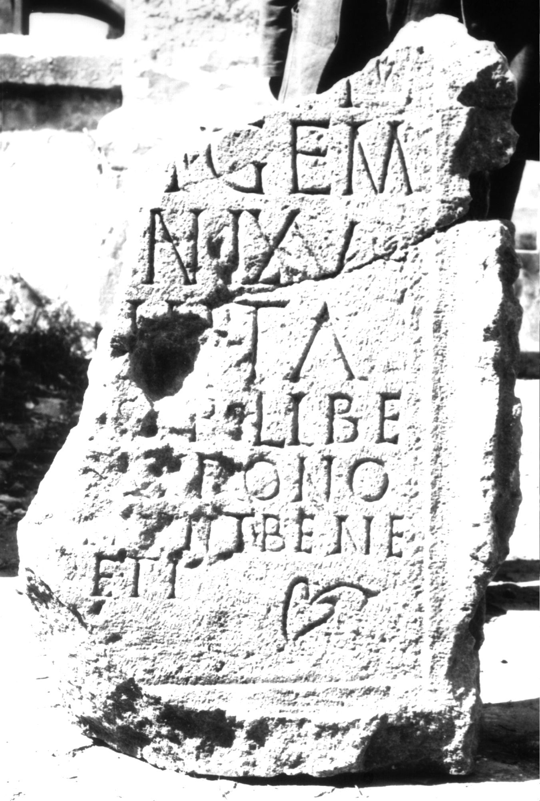

# EDH HD038972. Apulum

**Країна.** Румунія

**Провінція (код EDH).** Dac

**Місце знахідки (антична назва).** Apulum

**Сучасна назва.** Alba Iulia

**Деталі знахідки.** Tolstoi, {nordwestliche römische Nekropole}, bei, sekundär verwendet

**Координати.** 46.079325595,23.563780440

**Рік знахідки.** 1980

**Зберігання.** Alba Iulia, Muz. Unirii

**Датування (роки, від'ємні до н. е.).** 171 … 270

**Матеріал.** Kalkstein

**Тип пам'ятки.** Tafel

**Розміри (висота, ширина, глибина, см).** -80.0 × -50.0 × 18.0

## Текст (латинь, скорочення розкрито)

```
[---]li(?) / [--- leg(ionis) XII]I gem(inae) / [--- vixit] an(nos) LXV / [---]II(?)ita / [---] S[i]ro Libe/[ralis? p]atrono / [suo fec]erunt bene / [me]re(n)ti
```

## Текст у вихідному записі

```
[ ]LI / [ ]I GEM / [ ] AN LXV / [ ]IIITA / [ ] S[ ]RO LIBE / [ ]ATRONO / [ ]ERVNT BENE / [ ]RETI
```

## Коментар

Zwei aneinanderpassende Fragmente erhalten. Z. 1, 2, 3 und am Ender der Inschrift: hedera. IDR 3, 5: Z. 5/6: Libe/[ralis, -rti].

## Література

IDR 3, 5, 579; Foto u. Zeichnung. #

## Фото



Джерело https://edh.ub.uni-heidelberg.de/edh/inschrift/HD038972, ліцензія CC BY-SA 4.0. Оригінальний XML в архіві сирі_дані/edh_xml.zip
