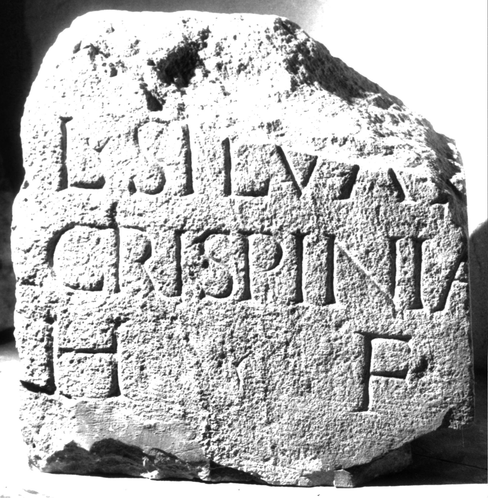

# EDH HD038978. Apulum

**Країна.** Румунія

**Провінція (код EDH).** Dac

**Місце знахідки (антична назва).** Apulum

**Сучасна назва.** Alba Iulia

**Координати.** 46.0669444,23.569999999

**Зберігання.** Alba Iulia, Muz. Unirii

**Датування (роки, від'ємні до н. е.).** 201 … 270

**Матеріал.** Kalkstein

**Тип пам'ятки.** Stele

**Розміри (висота, ширина, глибина, см).** -36.0 × -36.0 × 16.0

## Текст (латинь, скорочення розкрито)

```
$] / [V]al(erius) Silvan[us et] / [---] Crispinia[nus] / h(eredes) f(aciendum) [c(uraverunt)]
```

## Текст у вихідному записі

```
] / [ ]AL SILVAN[ ] / [ ] CRISPINIA[ ] / H F [ ]
```

## Література

IDR 3, 5, 592; Foto u. Zeichnung. #

## Фото



Джерело https://edh.ub.uni-heidelberg.de/edh/inschrift/HD038978, ліцензія CC BY-SA 4.0. Оригінальний XML в архіві сирі_дані/edh_xml.zip
