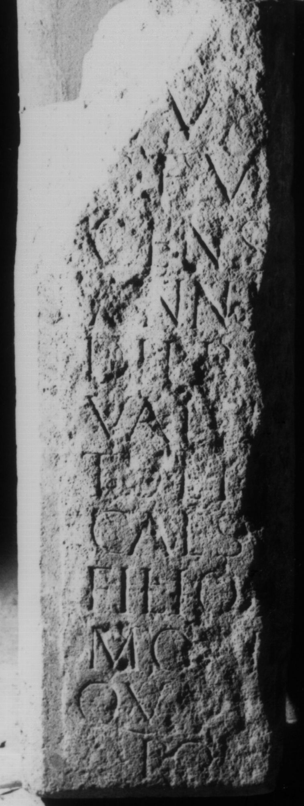

# EDH HD038979. Apulum

**Країна.** Румунія

**Провінція (код EDH).** Dac

**Місце знахідки (антична назва).** Apulum

**Сучасна назва.** Alba Iulia

**Деталі знахідки.** Festung, {Báthory-Kirche}, sekundär verwendet

**Координати.** 46.068786971,23.571510313

**Зберігання.** Alba Iulia, Muz. Unirii

**Датування (роки, від'ємні до н. е.).** 151 … 250

**Матеріал.** Kalkstein

**Тип пам'ятки.** Stele

**Розміри (висота, ширина, глибина, см).** -90.0 × -30.0 × 16.0

## Текст (латинь, скорочення розкрито)

```
D(is) [M(anibus)] / [C(aio)] Va[lerio] / C(ai) f(ilio) V[---] / Cens[onino? v(ixit)] / ann(os) [--- mens(ibus) --] / dieb(us) [---] / Valer[ia? mari?]to et [---] / Caes(aris?) [---] / filio [piissi?]/mo I[---] / Qua[---] / pos(uit) [---]
```

## Текст у вихідному записі

```
D [ ] / [ ] VA[ ] / C F V[ ] / CENS[ ] / ANN [ ] / DIEB [ ] / VALER[ ]TO ET [ ] / CAES [ ] / FILIO [ ] / MO I[ ] / QVA[ ] / POS [ ]
```

## Коментар

Linker Teil einer Stele oder Tafel, in späterer Zeit bearbeitet und als Baustein wiederverwendet.

## Література

IDR 3, 5, 593; Foto u. Zeichnung.
- CIL 03, 14482. #

## Фото



Джерело https://edh.ub.uni-heidelberg.de/edh/inschrift/HD038979, ліцензія CC BY-SA 4.0. Оригінальний XML в архіві сирі_дані/edh_xml.zip
