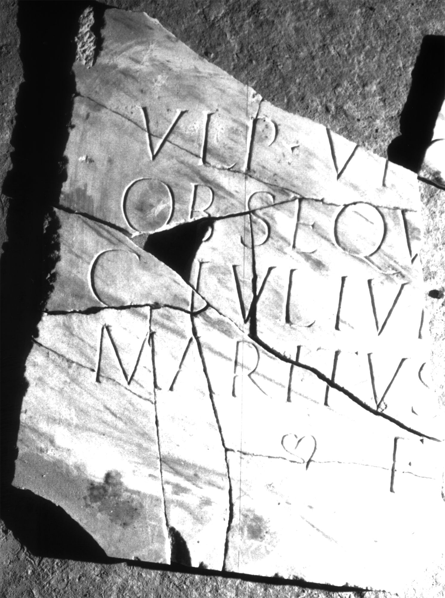

# EDH HD038997. Apulum

**Країна.** Румунія

**Провінція (код EDH).** Dac

**Місце знахідки (антична назва).** Apulum

**Сучасна назва.** Alba Iulia

**Координати.** 46.0669444,23.569999999

**Зберігання.** Alba Iulia, Muz. Unirii

**Датування (роки, від'ємні до н. е.).** 201 … 275

**Матеріал.** Marmor, geädert / farbig

**Тип пам'ятки.** Tafel

**Розміри (висота, ширина, глибина, см).** -131.0 × -66.0 × 3.0

## Текст (латинь, скорочення розкрито)

```
[D(is)] Manibus / Ulp(iae) Victorinae omni / obsequ[io] mar[it]ali / C(aius) Iul(ius) Iul[ianus] [a] m[i]lit(iis) / maritus [et Iulia] Ursula / fi[lia]
```

## Текст у вихідному записі

```
[ ] MANIBVS / VLP VICTORINAE OMNI / OBSEQV[ ] MAR[ ]ALI / C IVL IVL[ ] [ ] M[ ]LIT / MARITVS [ ] VRSVLA / FI[ ]
```

## Коментар

Mehrere Fragmente einer Tafel. Z. 6 (Anfang u. Ende): hederae.

## Література

IDR 3, 5, 612; Foto u. Zeichnung. #

## Фото



Джерело https://edh.ub.uni-heidelberg.de/edh/inschrift/HD038997, ліцензія CC BY-SA 4.0. Оригінальний XML в архіві сирі_дані/edh_xml.zip
