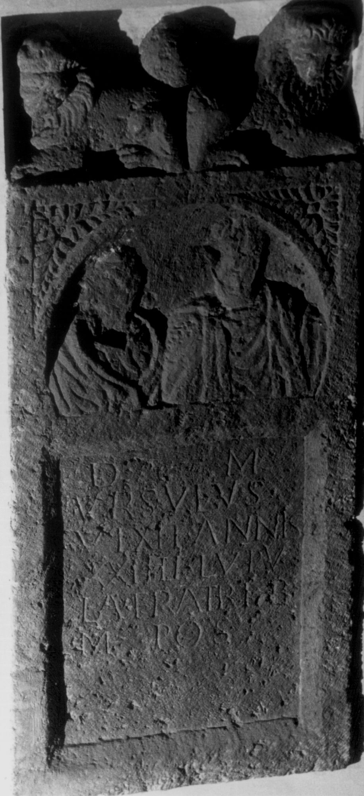

# EDH HD038999. Apulum

**Країна.** Румунія

**Провінція (код EDH).** Dac

**Місце знахідки (антична назва).** Apulum

**Сучасна назва.** Alba Iulia

**Деталі знахідки.** {Festung}

**Координати.** 46.068288248,23.571209907

**Зберігання.** Wien, Nationalbibl.

**Датування (роки, від'ємні до н. е.).** 151 … 250

**Матеріал.** Kalkstein

**Тип пам'ятки.** Stele

## Текст (латинь, скорочення розкрито)

```
D(is) M(anibus) / Ursulus / vixit annis / XXIIII Lupu/la fratri b(ene) / m(erenti) pos(uit)
```

## Текст у вихідному записі

```
D M / VRSVLVS / VIXIT ANNIS / XXIIII LVPV / LA FRATRI B / M POS
```

## Коментар

Autopsie: Buonopane, 2009. a

## Література

IDR 3, 5, 614; Foto.
- CIL 03, 01253.
- A. Buonopane - V. La Monaca, in: G.P. Marchi - J. Pál (Hrsg.), Epigrafi romane di Transilvania. Bibliotheca Capitolare di Verona, Manoscritto CCLXVII (Verona - Szeged 2010) 270, Nr. 17; Foto u. Zeichnung.
- F. Beutler - E. Weber (Hrsg.), Die römischen Inschriften der Österreichischen Nationalbibliothek (Wien 2015) 48, Nr. 31; Foto. #

## Фото



Джерело https://edh.ub.uni-heidelberg.de/edh/inschrift/HD038999, ліцензія CC BY-SA 4.0. Оригінальний XML в архіві сирі_дані/edh_xml.zip
