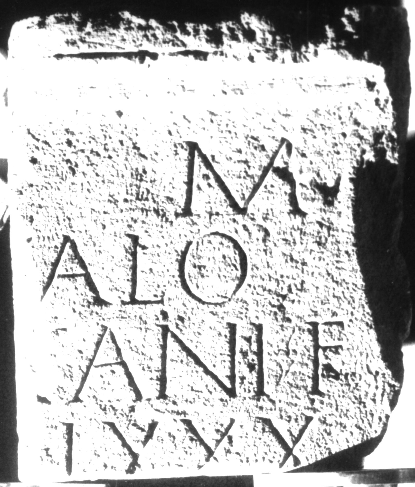

# EDH HD039000. Apulum

**Країна.** Румунія

**Провінція (код EDH).** Dac

**Місце знахідки (антична назва).** Apulum

**Сучасна назва.** Alba Iulia

**Координати.** 46.0669444,23.569999999

**Зберігання.** Alba Iulia, Muz. Unirii

**Датування (роки, від'ємні до н. е.).** 106 … 200

**Матеріал.** Kalkstein

**Тип пам'ятки.** Tafel

**Розміри (висота, ширина, глибина, см).** -48.0 × -43.0 × 19.0

## Текст (латинь, скорочення розкрито)

```
[D(is)] M(anibus) / [---]calo(?) / [---]cani f(ilio) / [vix(it) an(nos)] LXXX / [---]
```

## Текст у вихідному записі

```
[ ] M / [ ]CALO / [ ]CANI F / [ ] LXXX / [ ]
```

## Література

IDR 3, 5, 616; Foto u. Zeichnung. #

## Фото



Джерело https://edh.ub.uni-heidelberg.de/edh/inschrift/HD039000, ліцензія CC BY-SA 4.0. Оригінальний XML в архіві сирі_дані/edh_xml.zip
