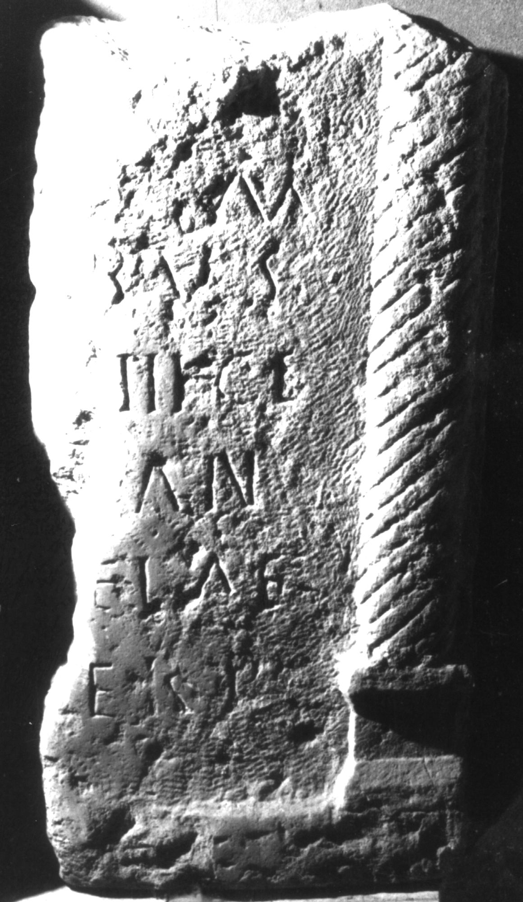

# EDH HD039008. Apulum

**Країна.** Румунія

**Провінція (код EDH).** Dac

**Місце знахідки (антична назва).** Apulum

**Сучасна назва.** Alba Iulia

**Координати.** 46.0669444,23.569999999

**Зберігання.** Alba Iulia, Muz. Unirii

**Датування (роки, від'ємні до н. е.).** 151 … 270

**Матеріал.** Kalkstein

**Тип пам'ятки.** Stele

**Розміри (висота, ширина, глибина, см).** -81.0 × -43.0 × 20.0

## Текст (латинь, скорочення розкрито)

```
[D(is)] M(anibus) / [---]bus / [--- leg(ionis) X]III ge(minae) / [vixit?] an(nis) / [---]EI AE / [--- pa?]ter p(osuit)
```

## Текст у вихідному записі

```
[ ] M / [ ]BVS / [ ]III GE / [ ] AN / [ ]EI AE / [ ]TER P
```

## Коментар

Unterer Teil einer Stele. Inschriftfeld ursprünglich von zwei tordierten Halbsäulen flankiert, davon heute noch eine erhalten.

## Література

IDR 3, 5, 617; Foto. #

## Фото



Джерело https://edh.ub.uni-heidelberg.de/edh/inschrift/HD039008, ліцензія CC BY-SA 4.0. Оригінальний XML в архіві сирі_дані/edh_xml.zip
