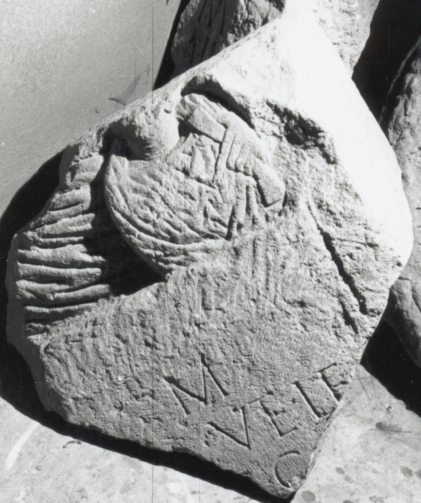

# EDH HD039015. Apulum

**Країна.** Румунія

**Провінція (код EDH).** Dac

**Місце знахідки (антична назва).** Apulum

**Сучасна назва.** Alba Iulia

**Координати.** 46.0669444,23.569999999

**Зберігання.** Alba Iulia, Muz. Unirii

**Датування (роки, від'ємні до н. е.).** 171 … 270

**Матеріал.** Kalkstein

**Тип пам'ятки.** Stele

**Розміри (висота, ширина, глибина, см).** -55.0 × -55.0 × 16.0

## Текст (латинь, скорочення розкрито)

```
[D(is)] M(anibus) / [---]s vet(eranus) leg(ionis) / [XIII g(eminae) ---] C[---] / [&
```

## Текст у вихідному записі

```
[ ] M / [ ]S VET LEG / [ ] C[ ] / [
```

## Коментар

Rechter Teil einer Stele. Spüren von einer spätereren Bearbeitung erkennbar. Reliefdarstellung über den Inschriftfeld. Büste von einem Erwachsenen und einem Kind in einer halbkreisförmigen Nische. Der Mann trägt ein Volumen in seiner linken Hand. Reste von einer Halbsäule noch erkennbar.

## Література

IDR 3, 5, 622; Foto u. Zeichnung. #

## Фото



Джерело https://edh.ub.uni-heidelberg.de/edh/inschrift/HD039015, ліцензія CC BY-SA 4.0. Оригінальний XML в архіві сирі_дані/edh_xml.zip
