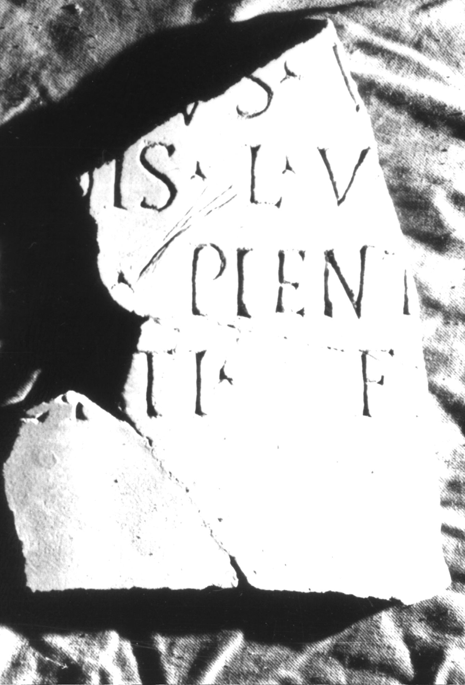
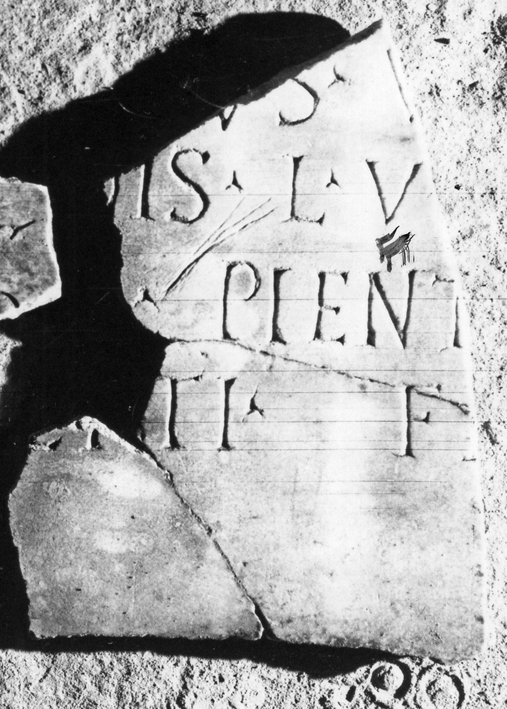
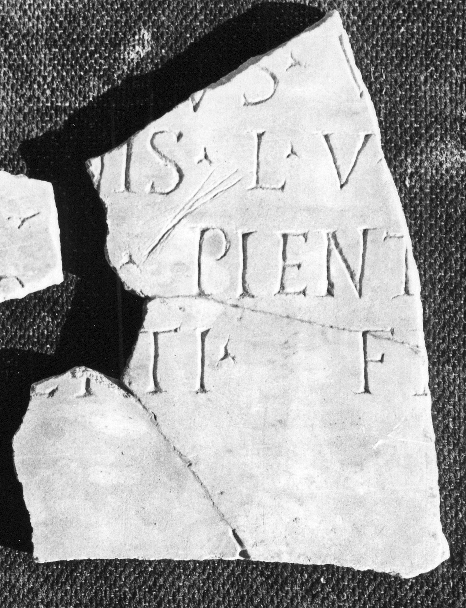

# EDH HD039017. Apulum

**Країна.** Румунія

**Провінція (код EDH).** Dac

**Місце знахідки (антична назва).** Apulum

**Сучасна назва.** Alba Iulia

**Деталі знахідки.** Dealul Furcilor, römische Nekropole

**Координати.** 46.0669444,23.569999999

**Зберігання.** Alba Iulia, Muz. Unirii

**Датування (роки, від'ємні до н. е.).** 201 … 270

**Матеріал.** Marmor

**Тип пам'ятки.** Tafel

**Розміри (висота, ширина, глибина, см).** -32.0 × -24.0 × 2.0

## Текст (латинь, скорочення розкрито)

```
$] / [---]us V[---] / [vixit an]nis L V [---] / [---] pient[issimo?] / [et n?]epti fe[cit]
```

## Текст у вихідному записі

```
] / [ ]VS V[ ] / [ ]NIS L V [ ] / [ ] PIENT[ ] / [ ]EPTI FE[ ]
```

## Коментар

Drei aneinanderpassende Fragmente erhalten.

## Література

IDR 3, 5, 625; Foto u. Zeichnung. #

## Фото







Джерело https://edh.ub.uni-heidelberg.de/edh/inschrift/HD039017, ліцензія CC BY-SA 4.0. Оригінальний XML в архіві сирі_дані/edh_xml.zip
