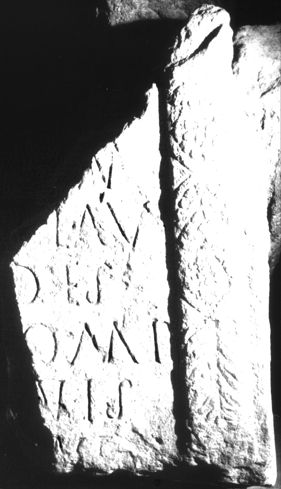

# EDH HD039020. Apulum

**Країна.** Румунія

**Провінція (код EDH).** Dac

**Місце знахідки (антична назва).** Apulum

**Сучасна назва.** Alba Iulia

**Координати.** 46.0669444,23.569999999

**Зберігання.** Alba Iulia, Muz. Unirii

**Датування (роки, від'ємні до н. е.).** 201 … 270

**Матеріал.** Kalkstein

**Тип пам'ятки.** Stele

**Розміри (висота, ширина, глибина, см).** -73.0 × -45.0 × 20.0

## Текст (латинь, скорочення розкрито)

```
[D(is)] M(anibus) / [---]L AV / [---]DES / [---]o mil(es?) / [--- vix(it) an]nis / [--- be]ne / [merenti?]
```

## Текст у вихідному записі

```
[ ] M / [ ]L AV / [ ]DES / [ ]O MIL / [ ]NIS / [ ]NE / [ ]
```

## Коментар

Rechter Teil einer Stele. Inschriftfeld ursprünglich von zwei Halbsäulen mit Traubenmoriven flankiert, davon heute noch eine erhalten.

## Література

IDR 3, 5, 628; Foto u. Zeichnung. #

## Фото



Джерело https://edh.ub.uni-heidelberg.de/edh/inschrift/HD039020, ліцензія CC BY-SA 4.0. Оригінальний XML в архіві сирі_дані/edh_xml.zip
