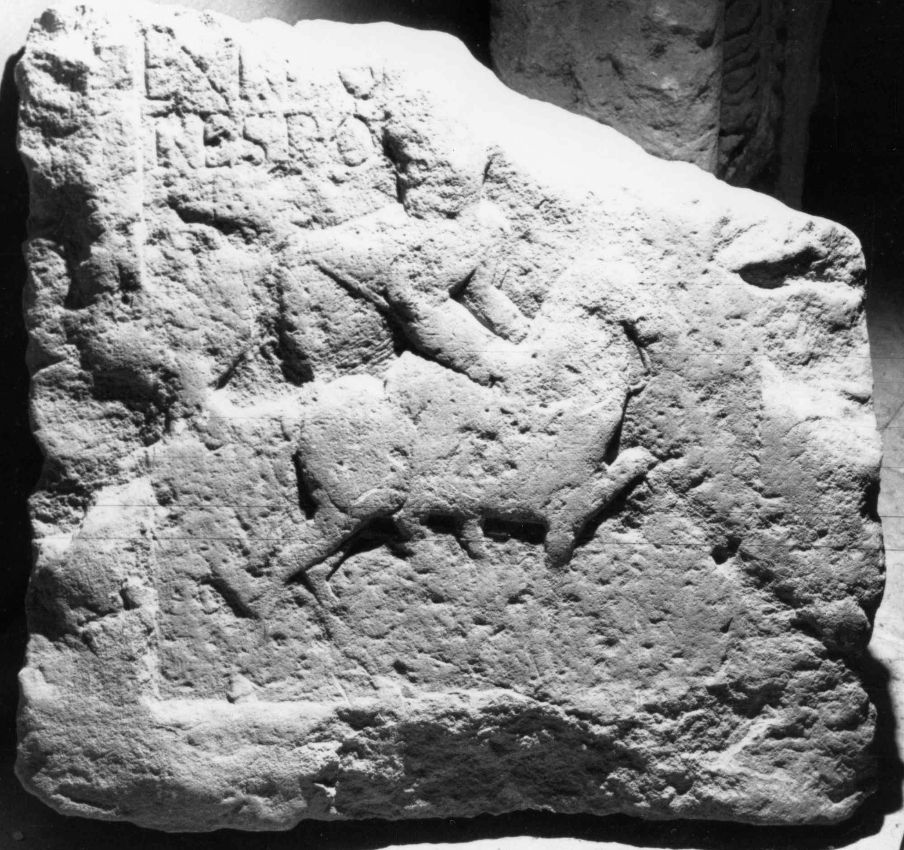

# EDH HD039045. Apulum

**Країна.** Румунія

**Провінція (код EDH).** Dac

**Місце знахідки (антична назва).** Apulum

**Сучасна назва.** Alba Iulia

**Координати.** 46.0669444,23.569999999

**Зберігання.** Alba Iulia, Muz. Unirii

**Датування (роки, від'ємні до н. е.).** 171 … 270

**Матеріал.** Kalkstein

**Тип пам'ятки.** Stele

**Розміри (висота, ширина, глибина, см).** -67.0 × -69.0 × 11.0

## Текст (латинь, скорочення розкрито)

```
$] / ex n(umero) O(?)[--- he]/res po[suit]
```

## Текст у вихідному записі

```
] / EX N O[ ] / RES PO[ ]
```

## Коментар

Unterer Teil einer Stele. Reliefdarstellung von Pferd und Ritter mit sagum unter dem Inschriftfeld.

## Література

IDR 3, 5, 632; Foto u. Zeichnung. #

## Фото



Джерело https://edh.ub.uni-heidelberg.de/edh/inschrift/HD039045, ліцензія CC BY-SA 4.0. Оригінальний XML в архіві сирі_дані/edh_xml.zip
