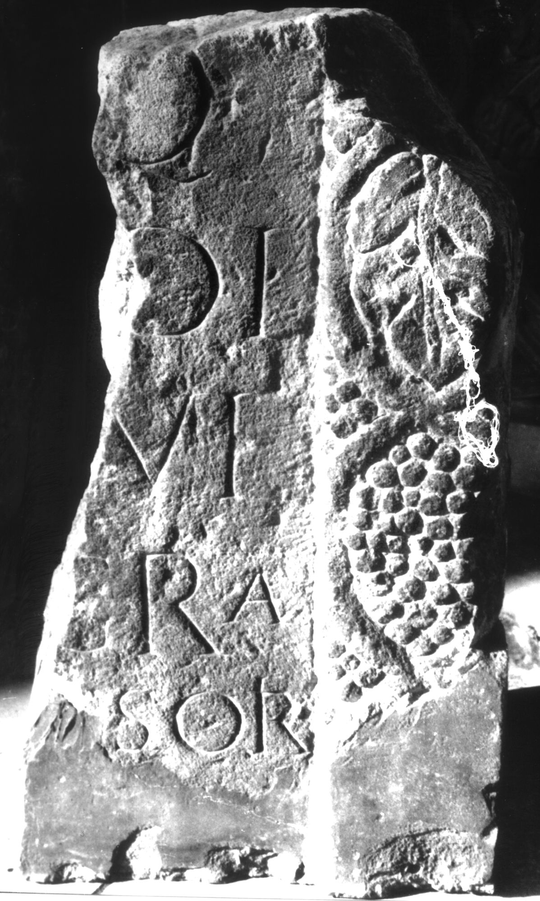
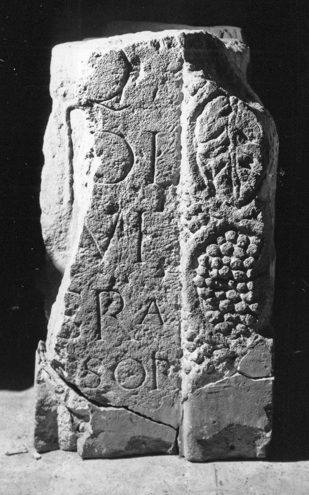

# EDH HD039050. Apulum

**Країна.** Румунія

**Провінція (код EDH).** Dac

**Місце знахідки (антична назва).** Apulum

**Сучасна назва.** Alba Iulia

**Координати.** 46.0669444,23.569999999

**Зберігання.** Alba Iulia, Muz. Unirii

**Датування (роки, від'ємні до н. е.).** 106 … 200

**Матеріал.** Kalkstein

**Тип пам'ятки.** Stele

**Розміри (висота, ширина, глибина, см).** -65.0 × -73.0 × 20.0

## Текст (латинь, скорочення розкрито)

```
$] / [---]Q / [---]DI / [---] Gra/[tus? ---]sori / [&
```

## Текст у вихідному записі

```
] / [ ]Q / [ ]DI / [ ] GRA / [ ]SORI / [
```

## Коментар

Fragment des rechten Teiles einer Stele. Inschriftfeld ursprünglich von zwei Halbsäulen mit Traubenmotiven flankiert, davon heute noch eine erhalten.

## Література

IDR 3, 5, 636; Foto. #

## Фото





Джерело https://edh.ub.uni-heidelberg.de/edh/inschrift/HD039050, ліцензія CC BY-SA 4.0. Оригінальний XML в архіві сирі_дані/edh_xml.zip
