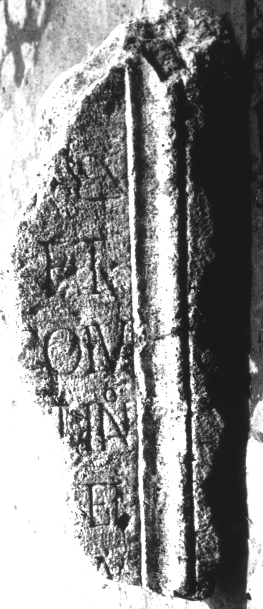

# EDH HD039081. Apulum

**Країна.** Румунія

**Провінція (код EDH).** Dac

**Місце знахідки (антична назва).** Apulum

**Сучасна назва.** Alba Iulia

**Деталі знахідки.** {Partoş}

**Координати.** 46.0463184,23.566650100

**Рік знахідки.** 1979

**Зберігання.** Alba Iulia, Muz. Unirii

**Датування (роки, від'ємні до н. е.).** 201 … 270

**Матеріал.** Kalkstein

**Тип пам'ятки.** Basis

**Розміри (висота, ширина, глибина, см).** -86.0 × -33.0 × 38.0

## Текст (латинь, скорочення розкрито)

```
$] / [---]s / [---] et / [---] co(n)iu/[gi --- Valen?]tino / [---] et / [---]a / [&
```

## Текст у вихідному записі

```
] / [ ]S / [ ] ET / [ ] COIV / [ ]TINO / [ ] ET / [ ]A / [
```

## Коментар

Z. 1: hedera.

## Література

IDR 3, 5, 639; Foto. #

## Фото



Джерело https://edh.ub.uni-heidelberg.de/edh/inschrift/HD039081, ліцензія CC BY-SA 4.0. Оригінальний XML в архіві сирі_дані/edh_xml.zip
