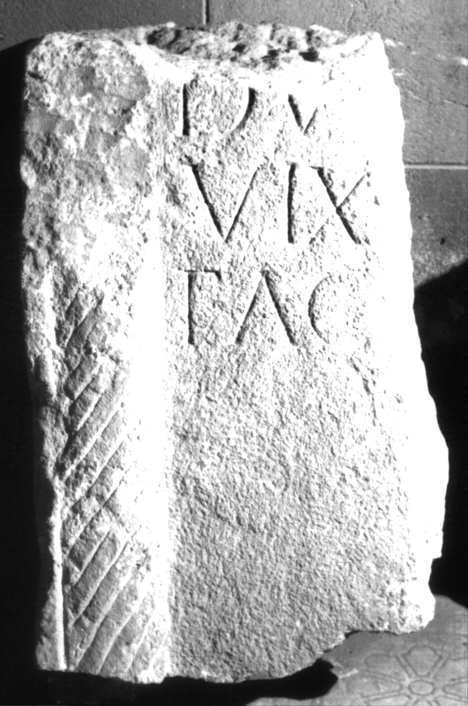

# EDH HD039083. Apulum

**Країна.** Румунія

**Провінція (код EDH).** Dac

**Місце знахідки (антична назва).** Apulum

**Сучасна назва.** Alba Iulia

**Координати.** 46.0669444,23.569999999

**Зберігання.** Alba Iulia, Muz. Unirii

**Датування (роки, від'ємні до н. е.).** 151 … 275

**Матеріал.** Kalkstein

**Тип пам'ятки.** Stele

**Розміри (висота, ширина, глибина, см).** -34.0 × -35.5 × 24.0

## Текст (латинь, скорочення розкрито)

```
$] / DV[---] / vix(it) [an(nis) ---] / fac(iendum?) [curavit?]
```

## Текст у вихідному записі

```
] / DV[ ] / VIX [ ] / FAC [ ]
```

## Коментар

Fragment vom linken Rand einer Stele; links und ehemals sicher auch rechts des Inschriftfeldes eine tordierte Säule.

## Література

IDR 3, 5, 640; Foto. #

## Фото



Джерело https://edh.ub.uni-heidelberg.de/edh/inschrift/HD039083, ліцензія CC BY-SA 4.0. Оригінальний XML в архіві сирі_дані/edh_xml.zip
