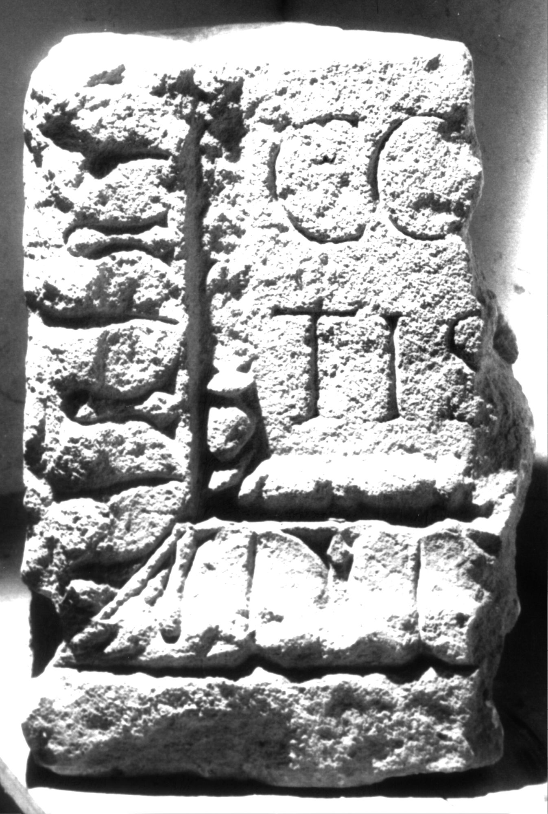

# EDH HD039086. Apulum

**Країна.** Румунія

**Провінція (код EDH).** Dac

**Місце знахідки (антична назва).** Apulum

**Сучасна назва.** Alba Iulia

**Деталі знахідки.** {Partoş}

**Координати.** 46.0463184,23.566650100

**Зберігання.** Alba Iulia, Muz. Unirii

**Датування (роки, від'ємні до н. е.).** 106 … 200

**Матеріал.** Gesteine

**Тип пам'ятки.** Basis

**Розміри (висота, ширина, глибина, см).** -48.0 × -35.0 × 28.0

## Текст (латинь, скорочення розкрито)

```
$] / co[niugi pien]/tiss[immo? ---]
```

## Текст у вихідному записі

```
] / CO[ ] / TISS[ ]
```

## Коментар

Unterer linker Teil einer Basis, in späterer Zeit bearbeitet und als Baustein wiederverwendet.

## Література

IDR 3, 5, 643; Foto. #

## Фото



Джерело https://edh.ub.uni-heidelberg.de/edh/inschrift/HD039086, ліцензія CC BY-SA 4.0. Оригінальний XML в архіві сирі_дані/edh_xml.zip
