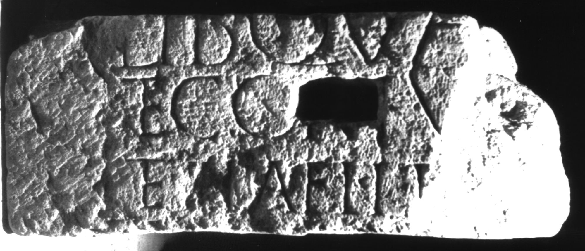

# EDH HD039088. Apulum

**Країна.** Румунія

**Провінція (код EDH).** Dac

**Місце знахідки (антична назва).** Apulum

**Сучасна назва.** Alba Iulia

**Координати.** 46.0669444,23.569999999

**Зберігання.** Alba Iulia, Muz. Unirii

**Датування (роки, від'ємні до н. е.).** 107 … 200

**Матеріал.** Kalkstein

**Тип пам'ятки.** Basis

**Розміри (висота, ширина, глибина, см).** -54.0 × -26.5 × 21.0

## Текст (латинь, скорочення розкрито)

```
$] / lib(ertus?) Qua[---] / et coniu[x? ---] / et pia fili[a ---] / [&
```

## Текст у вихідному записі

```
] / LIB QVA[ ] / ET CONIV[ ] / ET PIA FILI[ ] / [
```

## Коментар

Fragment bearbeitet und als Baustein wiederverwendet. IDR 3, 5: Z. 1: wahrscheinlich Qua[rtus] oder Qua[rta].

## Література

IDR 3, 5, 644; Foto u. Zeichnung. #

## Фото



Джерело https://edh.ub.uni-heidelberg.de/edh/inschrift/HD039088, ліцензія CC BY-SA 4.0. Оригінальний XML в архіві сирі_дані/edh_xml.zip
