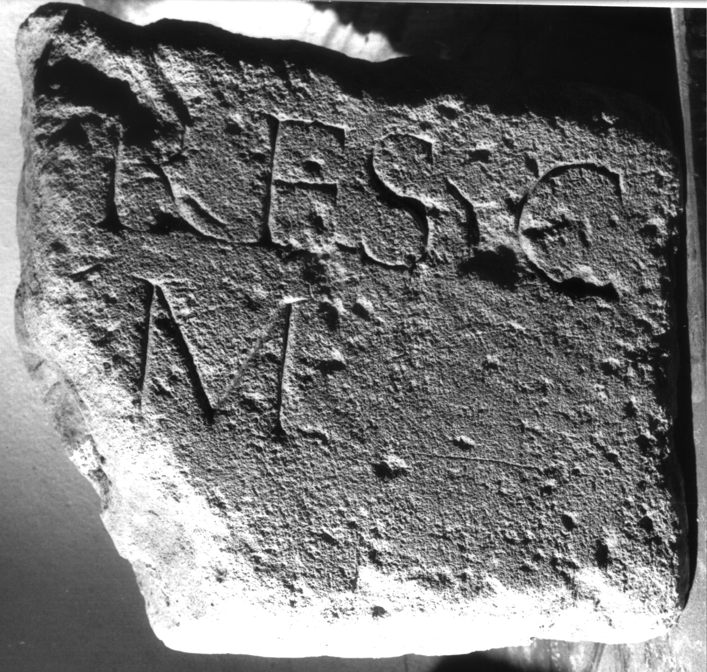

# EDH HD039089. Apulum

**Країна.** Румунія

**Провінція (код EDH).** Dac

**Місце знахідки (антична назва).** Apulum

**Сучасна назва.** Alba Iulia

**Деталі знахідки.** Praetorium des Statthalters

**Координати.** 46.076691,23.580099

**Зберігання.** Alba Iulia, Muz. Unirii

**Датування (роки, від'ємні до н. е.).** 151 … 270

**Матеріал.** Kalkstein

**Тип пам'ятки.** Stele?

**Розміри (висота, ширина, глибина, см).** -30.0 × -35.0 × 18.0

## Текст (латинь, скорочення розкрито)

```
$] / [--]res co[niugi] / [b(ene)?] m(erenti) [p(osuit)]
```

## Текст у вихідному записі

```
] / [ ]RES CO[ ] / [ ] M [ ]
```

## Коментар

Fragment einer Stele oder Tafel, bearbeitet und als Baustein wiederverwendet.

## Література

IDR 3, 5, 645; Foto u. Zeichnung. #

## Фото



Джерело https://edh.ub.uni-heidelberg.de/edh/inschrift/HD039089, ліцензія CC BY-SA 4.0. Оригінальний XML в архіві сирі_дані/edh_xml.zip
