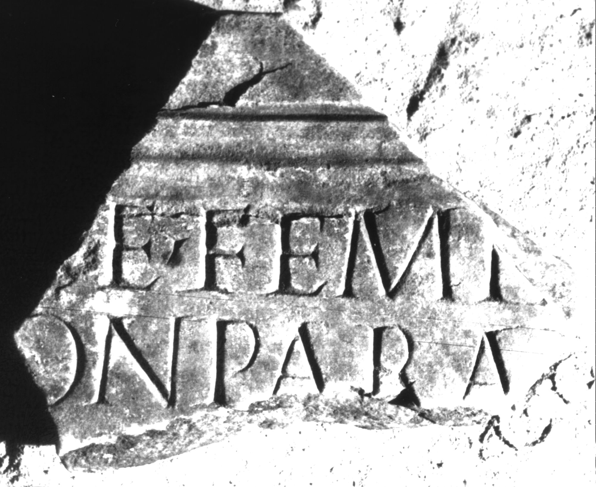

# EDH HD039091. Apulum

**Країна.** Румунія

**Провінція (код EDH).** Dac

**Місце знахідки (антична назва).** Apulum

**Сучасна назва.** Alba Iulia

**Деталі знахідки.** Dealul Furcilor, römische Nekropole

**Координати.** 46.0669444,23.569999999

**Зберігання.** Alba Iulia, Muz. Unirii

**Датування (роки, від'ємні до н. е.).** 171 … 270

**Матеріал.** Marmor

**Тип пам'ятки.** Tafel

**Розміри (висота, ширина, глибина, см).** -23.0 × -25.0 × 4.0

## Текст (латинь, скорочення розкрито)

```
[---a]e femin[ae stolatae?] / [coniugi? inc]conparab[ili ---] / [&
```

## Текст у вихідному записі

```
[ ]E FEMIN[ ] / [ ]CONPARAB[ ] / [
```

## Література

IDR 3, 5, 646; Foto u. Zeichnung. #

## Фото



Джерело https://edh.ub.uni-heidelberg.de/edh/inschrift/HD039091, ліцензія CC BY-SA 4.0. Оригінальний XML в архіві сирі_дані/edh_xml.zip
