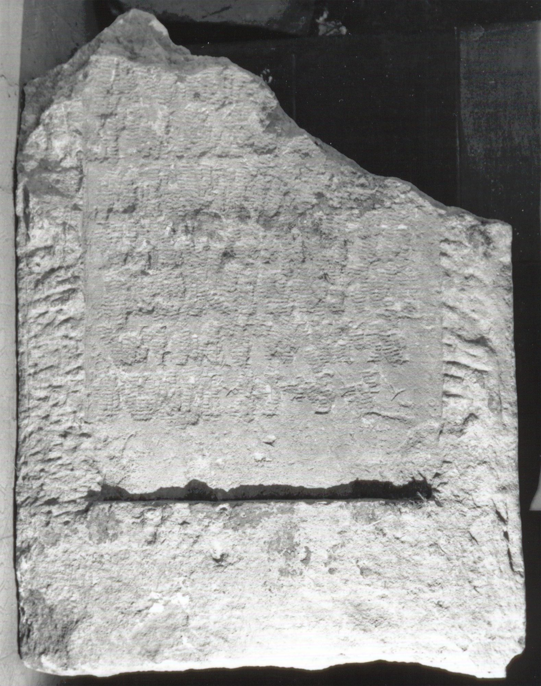

# EDH HD039093. Apulum

**Країна.** Румунія

**Провінція (код EDH).** Dac

**Місце знахідки (антична назва).** Apulum

**Сучасна назва.** Alba Iulia

**Деталі знахідки.** Tolstoi, {nordwestliche römische Nekropole}, Steinmetzwerkstatt bei

**Координати.** 46.079326392,23.563787679

**Зберігання.** Alba Iulia, Muz. Unirii

**Датування (роки, від'ємні до н. е.).** 106 … 200

**Матеріал.** Kalkstein

**Тип пам'ятки.** Stele

**Розміри (висота, ширина, глибина, см).** -117.0 × 88.0 × 26.0

## Текст (латинь, скорочення розкрито)

```
[[------]] / [[------]] / [[------]] / [[------]] / [[[---] VMA?]] / [[[---] h(ic) s(itus?) e(st)]]
```

## Текст у вихідному записі

```
[[ ]] / [[ ]] / [[ ]] / [[ ]] / [[[ ] VMA]] / [[[ ] H S E]]
```

## Коментар

Unterer Teil einer Stele. Inschriftfeld von zwei tordierten Halbsäulen flankiert. Inschriftfeld und Halbsäulen für eine Wiederverwendung als Grabstein eradiert. Einige Buchstaben noch lesbar erhalten. Letzte Zeile (Anfang): hedera.

## Література

IDR 3, 5, 647; Foto u. Zeichnung. #

## Фото



Джерело https://edh.ub.uni-heidelberg.de/edh/inschrift/HD039093, ліцензія CC BY-SA 4.0. Оригінальний XML в архіві сирі_дані/edh_xml.zip
