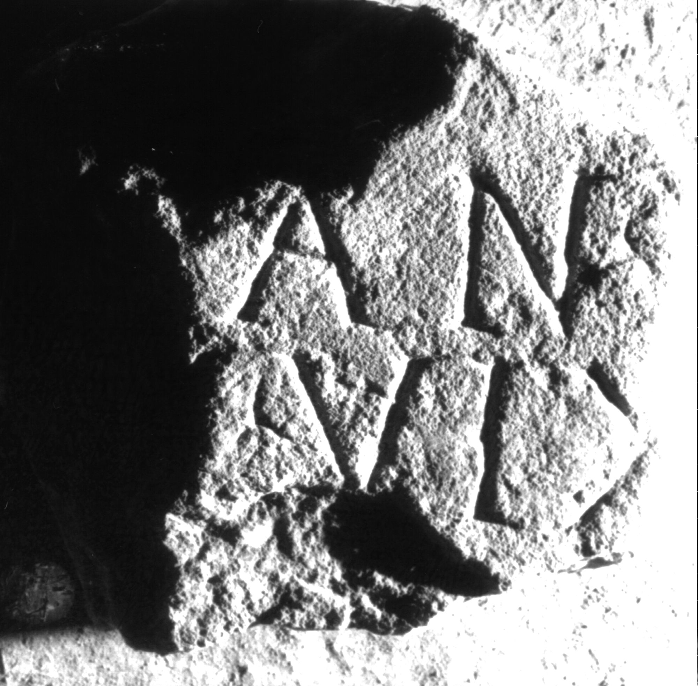

# EDH HD039098. Apulum

**Країна.** Румунія

**Провінція (код EDH).** Dac

**Місце знахідки (антична назва).** Apulum

**Сучасна назва.** Alba Iulia

**Деталі знахідки.** {Platoul Romanilor}

**Координати.** 46.0724587,23.556527400

**Зберігання.** Alba Iulia, Muz. Unirii

**Датування (роки, від'ємні до н. е.).** 151 … 270

**Матеріал.** Marmor

**Тип пам'ятки.** Stele?

**Розміри (висота, ширина, глибина, см).** -22.0 × -23.0 × 11.0

## Текст (латинь, скорочення розкрито)

```
$] / [vix(it)] an(nis) V(?)[---] / [--]I(?) vix(it) [&
```

## Текст у вихідному записі

```
] / [ ] AN V[ ] / [ ]I VIX [
```

## Коментар

Fragment einer Stele oder Tafel.

## Література

IDR 3, 5, 649; Foto u. Zeichnung. #

## Фото



Джерело https://edh.ub.uni-heidelberg.de/edh/inschrift/HD039098, ліцензія CC BY-SA 4.0. Оригінальний XML в архіві сирі_дані/edh_xml.zip
