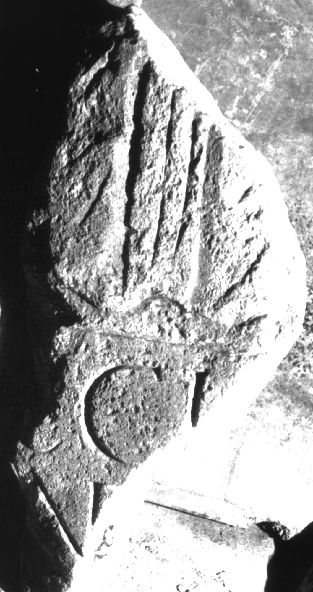

# EDH HD039103. Apulum

**Країна.** Румунія

**Провінція (код EDH).** Dac

**Місце знахідки (антична назва).** Apulum

**Сучасна назва.** Alba Iulia

**Координати.** 46.0669444,23.569999999

**Зберігання.** Alba Iulia, Muz. Unirii

**Датування (роки, від'ємні до н. е.).** 107 … 275

**Матеріал.** Kalkstein

**Тип пам'ятки.** Stele

**Розміри (висота, ширина, глибина, см).** -40.0 × -18.0 × 15.0

## Текст (латинь, скорочення розкрито)

```
$](?) CCI[---] / [---N---]
```

## Текст у вихідному записі

```
] CCI[ ] / [ ]
```

## Коментар

Unterer Teil eines Reliefs über der Inschrift. Reste eines Kleidungsstückes erkennbar.

## Література

IDR 3, 5, 651; Foto u. Zeichnung. #

## Фото



Джерело https://edh.ub.uni-heidelberg.de/edh/inschrift/HD039103, ліцензія CC BY-SA 4.0. Оригінальний XML в архіві сирі_дані/edh_xml.zip
