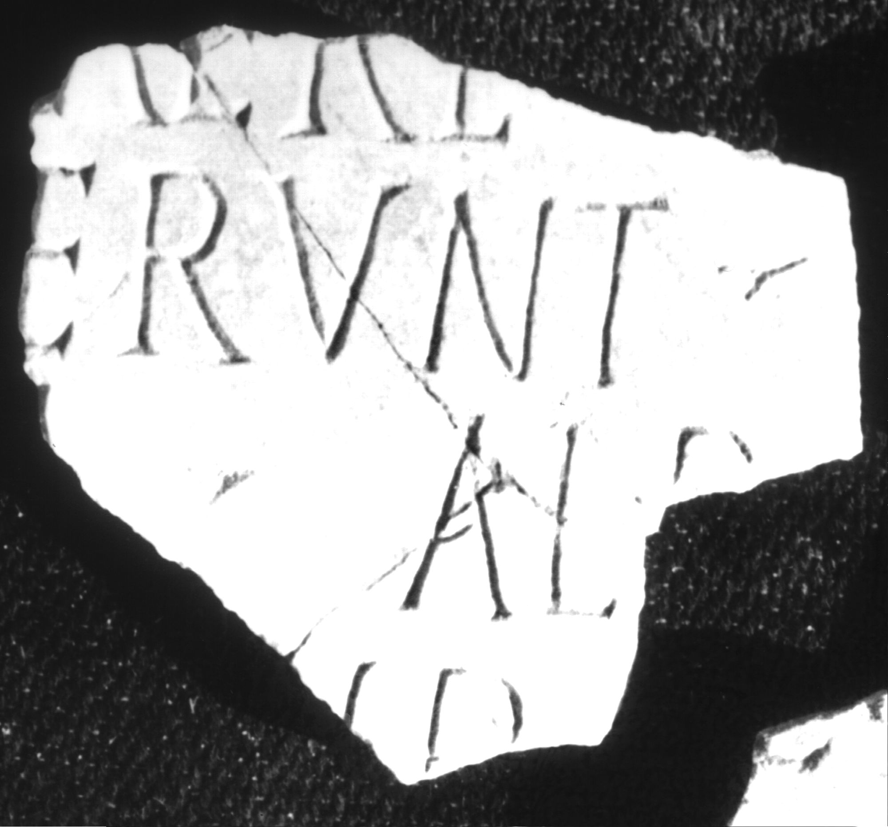
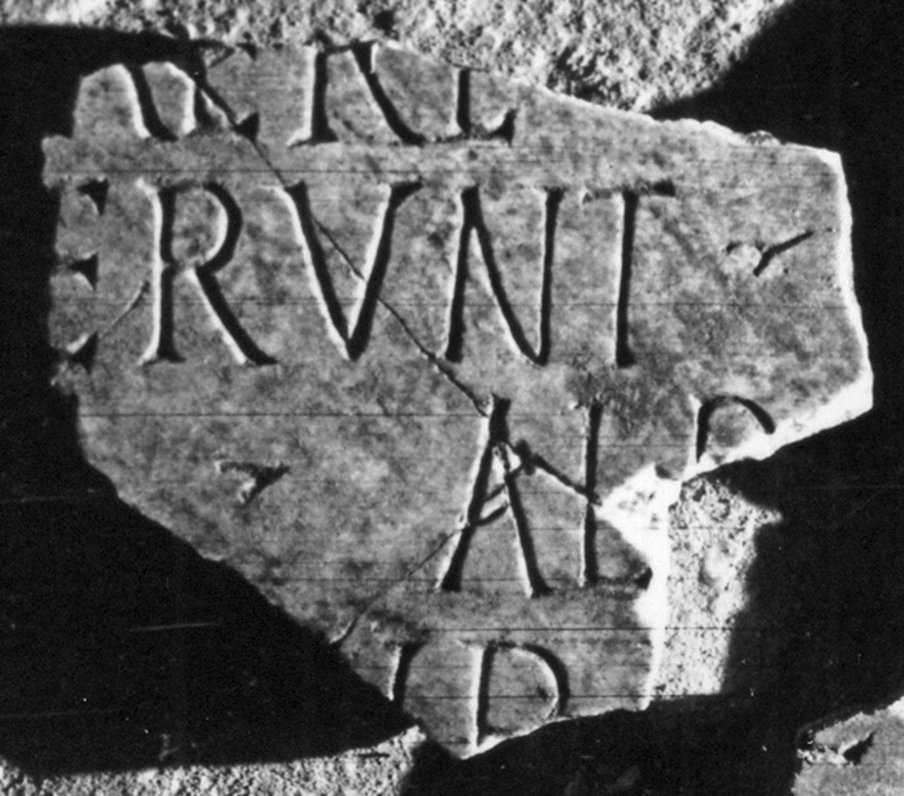
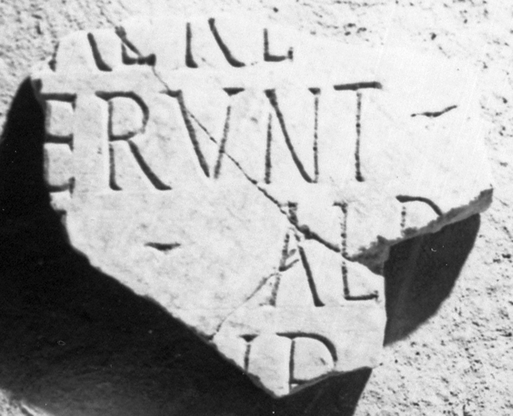

# EDH HD039133. Apulum

**Країна.** Румунія

**Провінція (код EDH).** Dac

**Місце знахідки (антична назва).** Apulum

**Сучасна назва.** Alba Iulia

**Деталі знахідки.** {Partoş}

**Координати.** 46.0463184,23.566650100

**Зберігання.** Alba Iulia, Muz. Unirii

**Датування (роки, від'ємні до н. е.).** 201 … 275

**Матеріал.** Marmor

**Тип пам'ятки.** Tafel

**Розміри (висота, ширина, глибина, см).** -16.5 × -18.0 × 2.0

## Текст (латинь, скорочення розкрито)

```
$] / [---] arere(?) [conlato?] / [fec]erunt [---] / M(arcus)(?) Alp[---](?) / [--- A?]ur(elius?) [---] / [&
```

## Текст у вихідному записі

```
] / [ ] ARERE [ ] / [ ]ERVNT [ ] / M ALP[ ] / [ ]VR [ ] / [
```

## Коментар

Fragment einer Tafel, in drei Stücke gebrochen.

## Література

IDR 3, 5, 661; Foto u. Zeichnung. #

## Фото







Джерело https://edh.ub.uni-heidelberg.de/edh/inschrift/HD039133, ліцензія CC BY-SA 4.0. Оригінальний XML в архіві сирі_дані/edh_xml.zip
