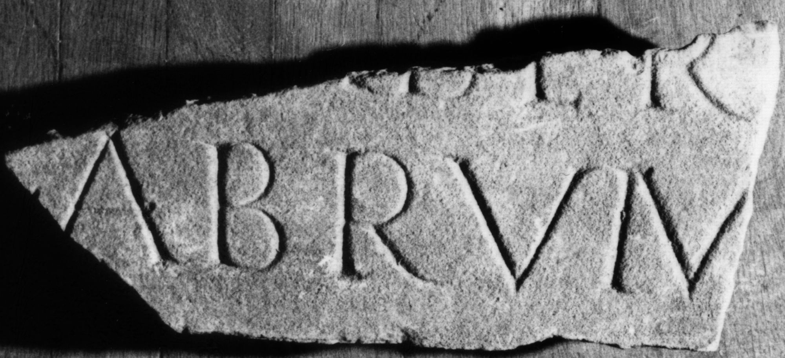

# EDH HD039176. Apulum

**Країна.** Румунія

**Провінція (код EDH).** Dac

**Місце знахідки (антична назва).** Apulum

**Сучасна назва.** Alba Iulia

**Деталі знахідки.** {Partoş}

**Координати.** 46.0463184,23.566650100

**Зберігання.** Sibiu, Muz. Brukenthal

**Датування (роки, від'ємні до н. е.).** 131 … 230

**Матеріал.** Marmor

**Тип пам'ятки.** Tafel

**Розміри (висота, ширина, глибина, см).** -10.0 × -20.0 × 4.0

## Текст (латинь, скорочення розкрито)

```
$] / [--- Alexa]nder(?) / [--- coll(egii)] fabrum / [&
```

## Текст у вихідному записі

```
] / [ ]NDER / [ ] FABRVM / [
```

## Література

IDR 3, 5, 664; Foto u. Zeichnung.
- CIL 03, 07806. #

## Фото



Джерело https://edh.ub.uni-heidelberg.de/edh/inschrift/HD039176, ліцензія CC BY-SA 4.0. Оригінальний XML в архіві сирі_дані/edh_xml.zip
