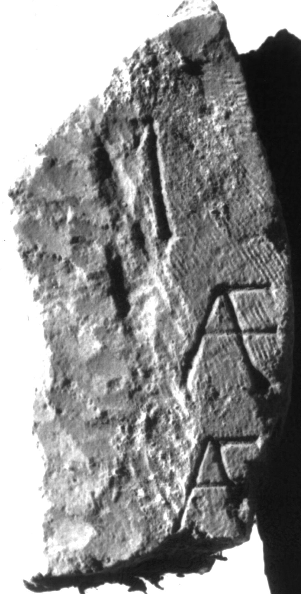

# EDH HD039192. Apulum

**Країна.** Румунія

**Провінція (код EDH).** Dac

**Місце знахідки (антична назва).** Apulum

**Сучасна назва.** Alba Iulia

**Координати.** 46.0669444,23.569999999

**Зберігання.** Alba Iulia, Muz. Unirii

**Датування (роки, від'ємні до н. е.).** 171 … 275

**Матеріал.** Gesteine

**Розміри (висота, ширина, глибина, см).** -35.0 × -18.0 × -13.0

## Текст (латинь, скорочення розкрито)

```
$]I [---?] / [---?]AE[---?] / [---?]AE[---?] / [&
```

## Текст у вихідному записі

```
]I [ ] / [ ]AE[ ] / [ ]AE[ ] / [
```

## Література

IDR 3, 5, 678; Foto. #

## Фото



Джерело https://edh.ub.uni-heidelberg.de/edh/inschrift/HD039192, ліцензія CC BY-SA 4.0. Оригінальний XML в архіві сирі_дані/edh_xml.zip
