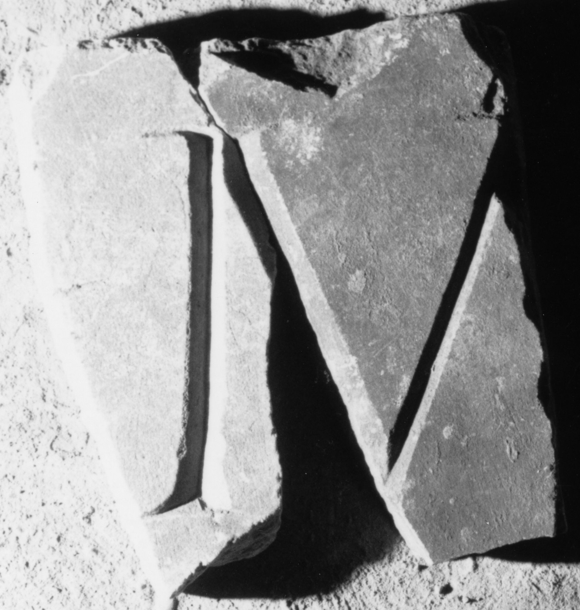
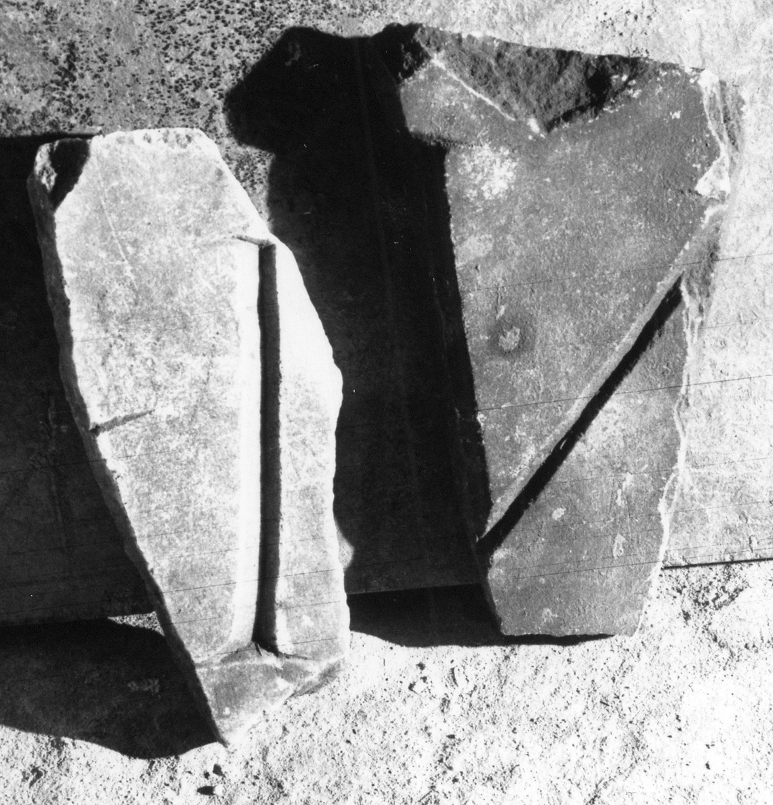

# EDH HD039199. Apulum

**Країна.** Румунія

**Провінція (код EDH).** Dac

**Місце знахідки (антична назва).** Apulum

**Сучасна назва.** Alba Iulia

**Координати.** 46.0669444,23.569999999

**Зберігання.** Alba Iulia, Muz. Unirii

**Датування (роки, від'ємні до н. е.).** 107 … 230

**Матеріал.** Marmor

**Тип пам'ятки.** Tafel

**Розміри (висота, ширина, глибина, см).** -21.0 × -19.0 × 3.0

## Текст (латинь, скорочення розкрито)

```
$]M[&
```

## Текст у вихідному записі

```
]M[
```

## Коментар

Zwei aneinanderpassende Fragmente einer Tafel.

## Література

IDR 3, 5, 683; Foto. #

## Фото





Джерело https://edh.ub.uni-heidelberg.de/edh/inschrift/HD039199, ліцензія CC BY-SA 4.0. Оригінальний XML в архіві сирі_дані/edh_xml.zip
