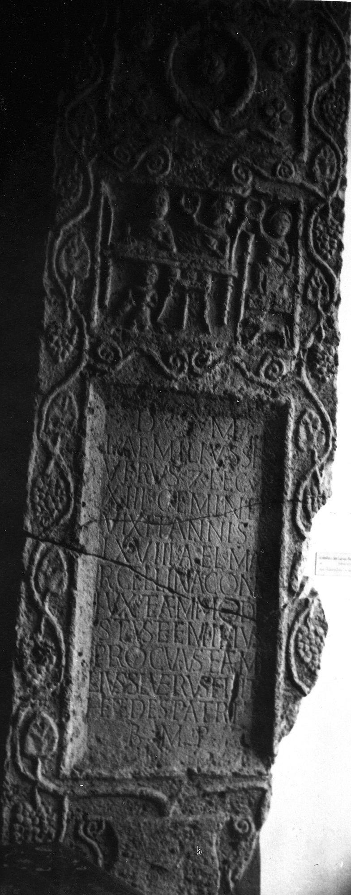

# EDH HD042040. Tropaeum Traiani

**Країна.** Румунія

**Провінція (код EDH).** MoI

**Місце знахідки (антична назва).** Tropaeum Traiani

**Сучасна назва.** Adamclisi

**Деталі знахідки.** {Marmorbasilika}, bei

**Координати.** 44.092763419,27.942314743

**Зберігання.** Dresden, Skulpturenslg.

**Датування (роки, від'ємні до н. е.).** 171 … 230

**Матеріал.** Kalkstein

**Тип пам'ятки.** Stele

**Розміри (висота, ширина, глибина, см).** 276.0 × 91.0 × 29.0

## Текст (латинь, скорочення розкрито)

```
D(is) M(anibus) / L(ucius) Aemilius Se/verus |(centurio) leg(ionis) / XIII gemin(a)e / vixit annis / LXVIII Ael(ia) Ma/rcellina con/iux et Aem(ilius) Mode/stus et (A)emilius / Proculus et Aemi/lius Severus fili(i) et / herdes patri / b(ene) m(erenti) p(osuerunt)
```

## Текст у вихідному записі

```
D M / L AEMILIVS SE / VERVS | LEG / XIII GEMINE / VIXIT ANNIS / LXVIII AEL MA / RCELLINA CON / IVX ET AEM MODE / STVS ET EMILIVS / PROCVLVS ET AEMI / LIVS SEVERVS FILI ET / HERDES PATRI / B M P
```

## Коментар

Oberhalb des Inschriftfeldes Totenmahlrelief; darüber ein weiteres Bildfeld mit einem Kranz. Zahlreiche hederae. (B): Conrad: Z. 8: Aemilius; Z. 10: Proclus.

## Література

S. Conrad, Die Grabstelen aus Moesia inferior. Untersuchungen zu Chronologie, Typologie und Ikonographie (Leipzig 2004) 198-199, Nr. 270; Taf. 109, 4. (B)
- CIL 03, 14214, 8. #

## Фото



Джерело https://edh.ub.uni-heidelberg.de/edh/inschrift/HD042040, ліцензія CC BY-SA 4.0. Оригінальний XML в архіві сирі_дані/edh_xml.zip
