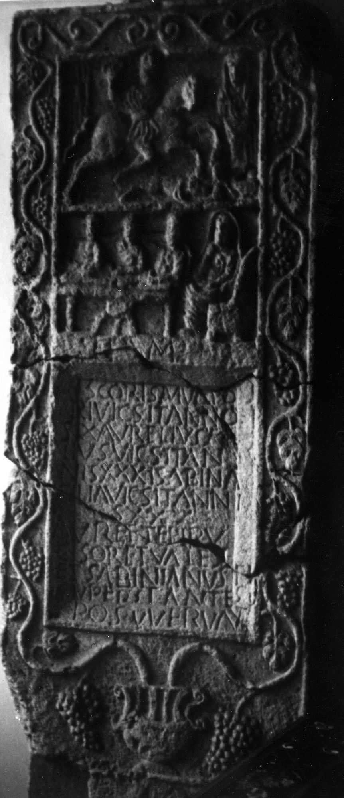

# EDH HD042041. Tropaeum Traiani

**Країна.** Румунія

**Провінція (код EDH).** MoI

**Місце знахідки (антична назва).** Tropaeum Traiani

**Сучасна назва.** Adamclisi

**Деталі знахідки.** {Via principalis}, bei

**Координати.** 44.092015857,27.944271442

**Зберігання.** Dresden, Skulpturenslg.

**Датування (роки, від'ємні до н. е.).** 171 … 250

**Матеріал.** Kalkstein

**Тип пам'ятки.** Stele

**Розміри (висота, ширина, глибина, см).** 213.0 × 82.0 × 25.0

## Текст (латинь, скорочення розкрито)

```
D(is) M(anibus) // Scoris Mucapo/ri vicsit(!) anno/s LX Aurelius fi/lius vicsit(!) an/nis XXXI Sabina / filia vicsit(!) anni/s XXX / Aur(elia) Ettepir(?) u/csor(!) et Vale(n)s / et Sabinianus fi(lii) / superstantes // posuerunt
```

## Текст у вихідному записі

```
D M / / SCORIS MVCAPO / RI VICSIT ANNO / S LX AVRELIVS FI / LIVS VICSIT AN / NIS XXXI SABINA / FILIA VICSIT ANNI / S XXX / AVR ETTEPIR V / CSOR ET VALES / ET SABINIANVS FI / SVPERSTANTES / / POSVERVNT
```

## Коментар

Oberhalb des Inschriftfeldes Totenmahlrelief; darüber ein weiteres Bildfeld mit einem Reiter und einer stehenden Frau. Z. 1 auf dem Streifen zwischen dem Inschriftfeld und dem Relief; Buchstabe D spiegelverkehrt. Der jeweils 1. Buchstabe der Z. 2-7 und 9-12, die Buchstaben I am Ende der Z. 7, FI am Ende der Z. 11, S am Ende der Z. 12 sowie die gesamte letzte Zeile befinden sich auf dem Rahmen des Inschriftfeldes. Z. 9: möglicherweise auch Eftepir. (B): Conrad, CIL III: Z. 3/4: anni/s; Conrad: Z. 9: Aurelia; Z. 10: Vale[n]s.

## Література

S. Conrad, Die Grabstelen aus Moesia inferior. Untersuchungen zu Chronologie, Typologie und Ikonographie (Leipzig 2004) 199, Nr. 271; Taf. 109, 3. (B)
- CIL 03, 14214, 14. (B) #

## Фото



Джерело https://edh.ub.uni-heidelberg.de/edh/inschrift/HD042041, ліцензія CC BY-SA 4.0. Оригінальний XML в архіві сирі_дані/edh_xml.zip
