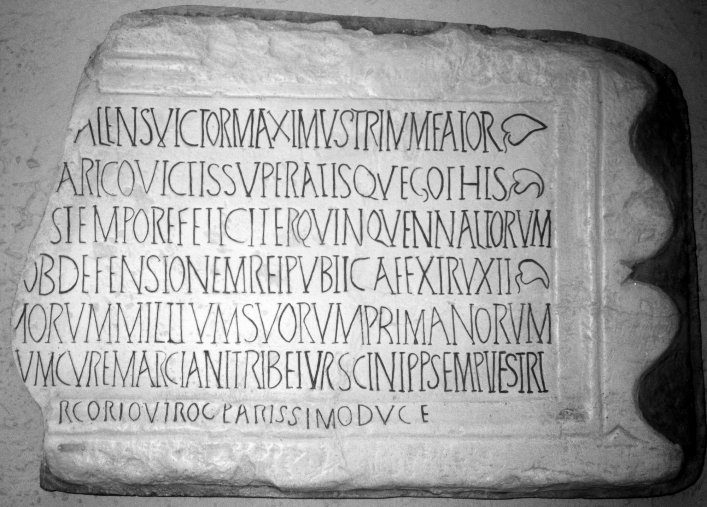

# EDH HD043349. Cius

**Країна.** Румунія

**Провінція (код EDH).** MoI

**Місце знахідки (антична назва).** Cius

**Сучасна назва.** Gârliciu, bei

**Деталі знахідки.** Hassarlîc, Hügel, {spätantike Festung}

**Координати.** 44.722923422,28.061793102

**Зберігання.** Constanţa, Muz. Ist. Naţ. Arh.

**Датування (роки, від'ємні до н. е.).** 351 … 400

**Матеріал.** Gesteine

**Тип пам'ятки.** Tafel

**Розміри (висота, ширина, глибина, см).** 85.0 × 58.0 × 15.0

## Текст (латинь, скорочення розкрито)

```
[D(ominus) n(oster) invictissimus? princeps? Fl(avius) V]alens victor maximus triumfator(!) / [semper Aug(ustus) in fidem recepto rege Athan]arico(?) victis superatisque Gothis / [ingruente item in victorias illa]s tempore feliciter quinquennaliorum / [--- hunc burgum] ob defensionem rei publicae extruxit / [labore --- devotissi]morum militum suorum Primanorum / [et --- commissor]um cur(a)e Marciani trib(uni) et Ursicini p(rae)p(ositi) semper vestri / [--- ordinante Fl(avio) Ste]rcorio viro clarissimo duce
```

## Текст у вихідному записі

```
[ ]ALENS VICTOR MAXIMVS TRIVMFATOR / [ ]ARICO VICTIS SVPERATISQVE GOTHIS / [ ]S TEMPORE FELICITER QVINQVENNALIORVM / [ ] OB DEFENSIONEM REI PVBLICAE EXTRVXIT / [ ]MORVM MILITVM SVORVM PRIMANORVM / [ ]VM CVRE MARCIANI TRIB ET VRSICINI PP SEMPER VESTRI / [ ]RCORIO VIRO CLARISSIMO DVCE
```

## Коментар

Textwiedergabe nach CIL III 7494. Hederae. Z. 7: Text in den Rahmen eingemeißelt.

## Література

CIL 03, 06159.
- CIL 03, 07494.
- ILS 0770.
- E. Popescu, Inscripţiile greceşti şi latine din secolele IV-XIII descoperite în România (Bucureşti 1976) 241-244, Nr. 233; Foto. #

## Фото



Джерело https://edh.ub.uni-heidelberg.de/edh/inschrift/HD043349, ліцензія CC BY-SA 4.0. Оригінальний XML в архіві сирі_дані/edh_xml.zip
