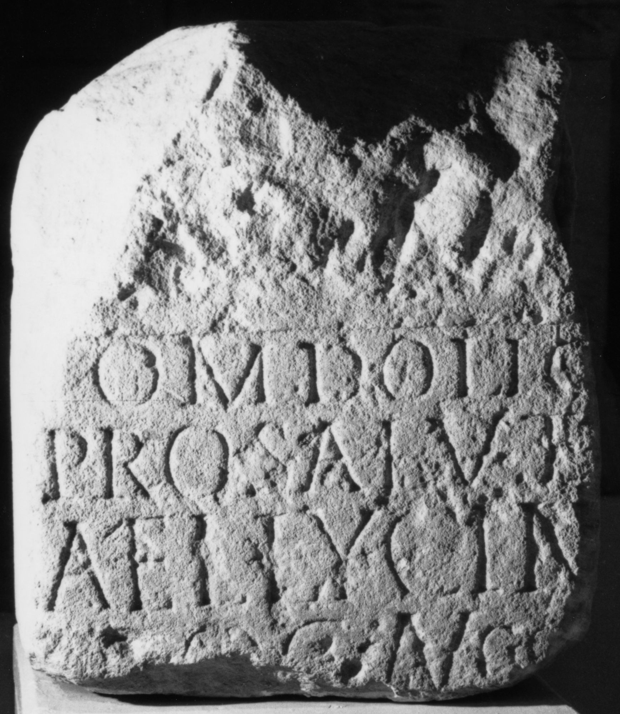

# EDH HD043601. Napoca

**Країна.** Румунія

**Провінція (код EDH).** Dac

**Місце знахідки (антична назва).** Napoca

**Сучасна назва.** Cluj-Napoca

**Координати.** 46.771741,23.576094000

**Зберігання.** Cluj-Napoca, Muz. Naţ. Ist. Transilv.

**Датування (роки, від'ємні до н. е.).** 198 … 211

**Тип пам'ятки.** Altar

**Розміри (висота, ширина, глибина, см).** -55.0 × -46.0

## Текст (латинь, скорочення розкрито)

```
I(ovi) O(ptimo) M(aximo) Dolic(heno) / pro salute / Ael(i) Lycini / p[r]oc(uratoris) Augg(ustorum) / [&
```

## Текст у вихідному записі

```
I O M DOLIC / PRO SALVTE / AEL LYCINI / P[ ]OC AVGG / [
```

## Література

CIL 03, 07659.
- CCID 140; Taf. 30, 140.
- PIR S 258. #

## Фото



Джерело https://edh.ub.uni-heidelberg.de/edh/inschrift/HD043601, ліцензія CC BY-SA 4.0. Оригінальний XML в архіві сирі_дані/edh_xml.zip
