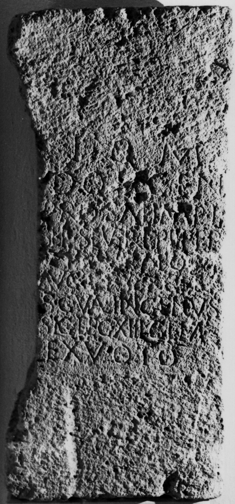

# EDH HD043616. Aquae, aus?

**Країна.** Румунія

**Провінція (код EDH).** Dac

**Місце знахідки (антична назва).** Aquae, aus?

**Сучасна назва.** Călan

**Деталі знахідки.** {Sâncrai}

**Координати.** 45.7535047,22.977810200

**Рік знахідки.** -1905

**Зберігання.** Cluj-Napoca, Muz. Naţ. Ist. Transilv.

**Датування (роки, від'ємні до н. е.).** 209 … 211

**Тип пам'ятки.** Altar

**Розміри (висота, ширина, глибина, см).** 99.0 × -50.0

## Текст (латинь, скорочення розкрито)

```
I(ovi) O(ptimo) M(aximo) / Dolic(h)en(o) / pro sal(ute) Imp(eratorum) L(uci) / Sep(timi) Severi Pii Pert(inacis) / [et?] [[M(arci) Aur(eli) A]]nton[[in]]i / Aug(usti) [[et P(ubli) Sep(timi) Ge]]taes(!) / {S} C(aius) Val(erius) Ingenu(u)s / sig(nifer) leg(ionis) XIII gem(inae) / ex voto
```

## Текст у вихідному записі

```
I O M / DOLICEN / PRO SAL IMP L / SEP SEVERI PII PERT / [ ] [[M AVR A]]NTON[[IN]]I / AVG [[ET P SEP GE]]TAES / S C VAL INGENVS / SIG LEG XIII GEM / EX VOTO
```

## Література

CCID 161; Taf. 31, 161 (Zeichnung).
- IDR 3, 3, 015; fig. 13 (Foto u. Zeichnung). #

## Фото



Джерело https://edh.ub.uni-heidelberg.de/edh/inschrift/HD043616, ліцензія CC BY-SA 4.0. Оригінальний XML в архіві сирі_дані/edh_xml.zip
