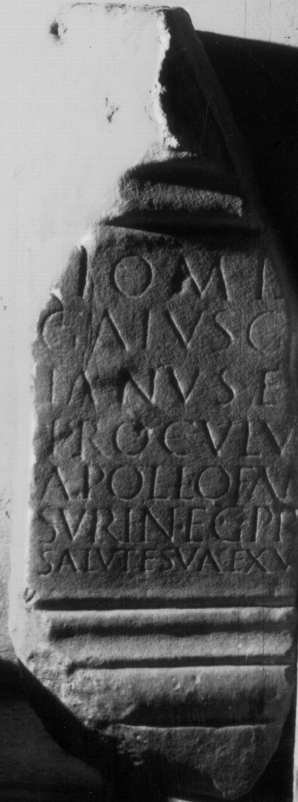

# EDH HD043622. Colonia Ulpia Traiana Sarmizegetusa

**Країна.** Румунія

**Провінція (код EDH).** Dac

**Місце знахідки (антична назва).** Colonia Ulpia Traiana Sarmizegetusa

**Сучасна назва.** Sarmizegetusa

**Координати.** 45.516666699,22.783333299

**Рік знахідки.** 1878

**Зберігання.** Lugoj, Muz. Ist. Etnogr. Arta

**Датування (роки, від'ємні до н. е.).** 201 … 250

**Тип пам'ятки.** Altar

**Розміри (висота, ширина, глибина, см).** -82.0 × -27.0 × -20.0

## Текст (латинь, скорочення розкрито)

```
I(ovi) O(ptimo) M(aximo) D(olicheno) / Gaius G[a]/ianus e[t] / Proculu[s] / Apollofan[es] / Suri neg(otiatores) pr[o] / salute sua ex v(oto)
```

## Текст у вихідному записі

```
I O M D / GAIVS G[ ] / IANVS E[ ] / PROCVLV[ ] / APOLLOFAN[ ] / SVRI NEG PR[ ] / SALVTE SVA EX V
```

## Література

CIL 03, 07915.
- IDR 3, 2, 203; fig. 164 (Foto u. Zeichnung).
- CCID 169; Taf. 31, 169. #

## Фото



Джерело https://edh.ub.uni-heidelberg.de/edh/inschrift/HD043622, ліцензія CC BY-SA 4.0. Оригінальний XML в архіві сирі_дані/edh_xml.zip
