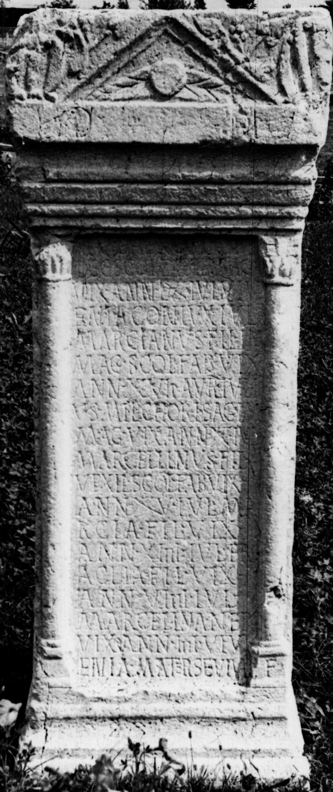

# EDH HD043631. Izvoru Bârzii

**Країна.** Румунія

**Провінція (код EDH).** Dac

**Сучасна назва.** Izvoru Bârzii

**Деталі знахідки.** Schitu-Topolniţei, {Kloster}

**Координати.** 44.760241731,22.608103752

**Зберігання.** Drobeta - Turnu Severin, Muz. Reg. Porţilor de Fier

**Датування (роки, від'ємні до н. е.).** 201 … 270

**Тип пам'ятки.** Altar

**Розміри (висота, ширина, глибина, см).** 185.0 × 65.0 × 61.0

## Текст (латинь, скорочення розкрито)

```
D(is) M(anibus) // Iul(ius) Herculanus / dec(urio) sc(h)ol(ae) fab(rum) i{i}mag(inifer) / vix(it) ann(os) LXXX Iul(ia) Viv/enia coniux Iul(ius) / Marcianus fil(ius) im/{m}ag(inifer) sc(h)ol(ae) fab(rum) vix(it) / ann(os) XXVII Aur(elius) Iuli/us mil(es) c(o)hor(tis) I sag(ittariorum) im/{m}ag(inifer) vix(it) ann(os) XXX Iul(ius) / Marcellinus fil(ius) / vexil(larius) sc(h)ol(ae) fab(rum) vix(it) / ann(os) XXV Iul(ia) Ma/rcia fil(ia) vix(it) / ann(os) XIIII Iul(ia) (H)er/aclia fil(ia) vix(it) / ann(os) VIIII Iul(ia) / Marcell<i>na nep(os) / vix(it) ann(os) IIII Viv/enia mater se viva f(ecit)
```

## Текст у вихідному записі

```
D M / / IVL HERCVLANVS / DEC SCOL FAB IIMAG / VIX ANN LXXX IVL VIV / ENIA CONIVX IVL / MARCIANVS FIL IM / MAG SCOL FAB VIX / ANN XXVII AVR IVLI / VS MIL CHOR I SAG IM / MAG VIX ANN XXX IVL / MARCELLINVS FIL / VEXIL SCOL FAB VIX / ANN XXV IVL MA / RCIA FIL VIX / ANN XIIII IVL ER / ACLIA FIL VIX / ANN VIIII IVL / MARCELLNA NEP / VIX ANN IIII VIV / ENIA MATER SE VIVA F
```

## Коментар

Inschriftfeld von zwei Halbsäulen flankiert. Z. 1 auf der corona. Z. 20 (Ende): Buchstabe F auf dem Sockel der rechten Halbsäule. (B): CIL III 1215; CIL III 1583; CIL III 8018; ILS; IDR II; ILD; Ardevan: Lesung unvollständig / abweichend.

## Література

CIL 03, 01215. (B)
- CIL 03, 01583. (B)
- CIL 03, 08018. (B)
- ILS 7247. (B)
- IDR 2, 135; Foto. (B)
- IDR 3, 5, 006* ILD 080. (B)
- AE 2001, 1722.
- R. Ardevan, Sargetia 27, 1997/98, 247-252. (B) - AE 2001. #

## Фото



Джерело https://edh.ub.uni-heidelberg.de/edh/inschrift/HD043631, ліцензія CC BY-SA 4.0. Оригінальний XML в архіві сирі_дані/edh_xml.zip
