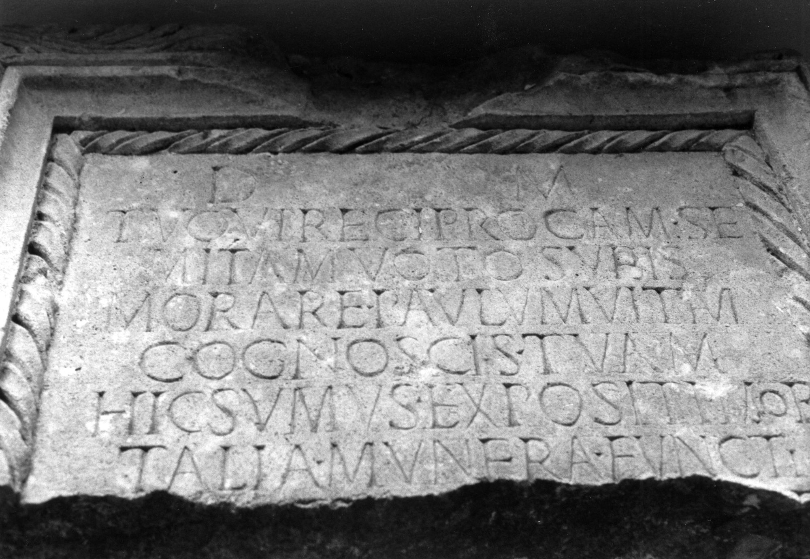

# EDH HD043650. Napoca

**Країна.** Румунія

**Провінція (код EDH).** Dac

**Місце знахідки (антична назва).** Napoca

**Сучасна назва.** Cluj-Napoca

**Деталі знахідки.** {Strada Constantin Brâncuși} - {Bulevardul Nicolae Titulescu}, zwischen, spätantike Nekropole

**Координати.** 46.764821390,23.606146769

**Рік знахідки.** 1987

**Датування (роки, від'ємні до н. е.).** 201 … 250

**Тип пам'ятки.** Tafel?

**Розміри (висота, ширина, глибина, см).** -61.0 × 102.0 × 22.0

## Текст (латинь, скорочення розкрито)

```
D(is) M(anibus) / tu qui reciprocam se/mitam voto subis / morare paulum vitam / cognoscis tuam / hic sumus expositi mor/talia munera functi / [&
```

## Текст у вихідному записі

```
D M / TV QVI RECIPROCAM SE / MITAM VOTO SVBIS / MORARE PAVLVM VITAM / COGNOSCIS TVAM / HIC SVMVS EXPOSITI MOR / TALIA MVNERA FVNCTI / [
```

## Література

AE 2000, 1242.
- ILD 565.
- R. Ardevan - I. Hica, ActaMusNapoca 37, 1, 2000, 243-245, Nr. 1; fig. 1 a; fig. 1 b (Zeichnung). - AE 2000. #

## Фото



Джерело https://edh.ub.uni-heidelberg.de/edh/inschrift/HD043650, ліцензія CC BY-SA 4.0. Оригінальний XML в архіві сирі_дані/edh_xml.zip
