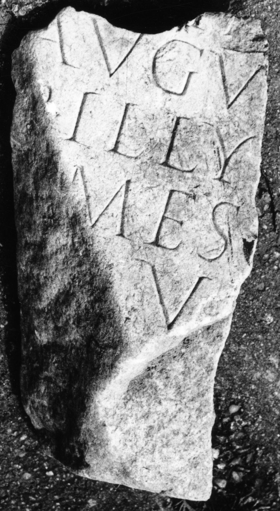

# EDH HD043680. Tibiscum

**Країна.** Румунія

**Провінція (код EDH).** Dac

**Місце знахідки (антична назва).** Tibiscum

**Сучасна назва.** Caransebeş

**Деталі знахідки.** Jupa, {Lager, Porta praetoria}

**Координати.** 45.466259632,22.190896868

**Датування (роки, від'ємні до н. е.).** 161 … 200

**Тип пам'ятки.** Altar

**Розміри (висота, ширина, глибина, см).** -30.0 × -14.0 × -14.0

## Текст (латинь, скорочення розкрито)

```
$] / [---]ia[ni? proc(uratoris)?] / Augu[sti] / [pe]r Illy[ricum] / [Her]mes [vilicus?] / [eius?] v(otum) [s(olvit) l(ibens) m(erito)]
```

## Текст у вихідному записі

```
] / [ ]IA[ ] / AVGV[ ] / [ ]R ILLY[ ] / [ ]MES [ ] / [ ] V [ ]
```

## Коментар

Ergänzungsvorschlag nach Piso und Benea. Datierung: nach der Einrichtung der Prokuratur per Illyricum unter Mark Aurel.

## Література

AE 1999, 1301.
- ILD 212.
- I. Piso - D. Benea, ActaMusNapoca 36, 1, 1999, 102-104, Nr. 7; fig. 9a; fig. 9b (Zeichnung). - AE 1999. #

## Фото



Джерело https://edh.ub.uni-heidelberg.de/edh/inschrift/HD043680, ліцензія CC BY-SA 4.0. Оригінальний XML в архіві сирі_дані/edh_xml.zip
