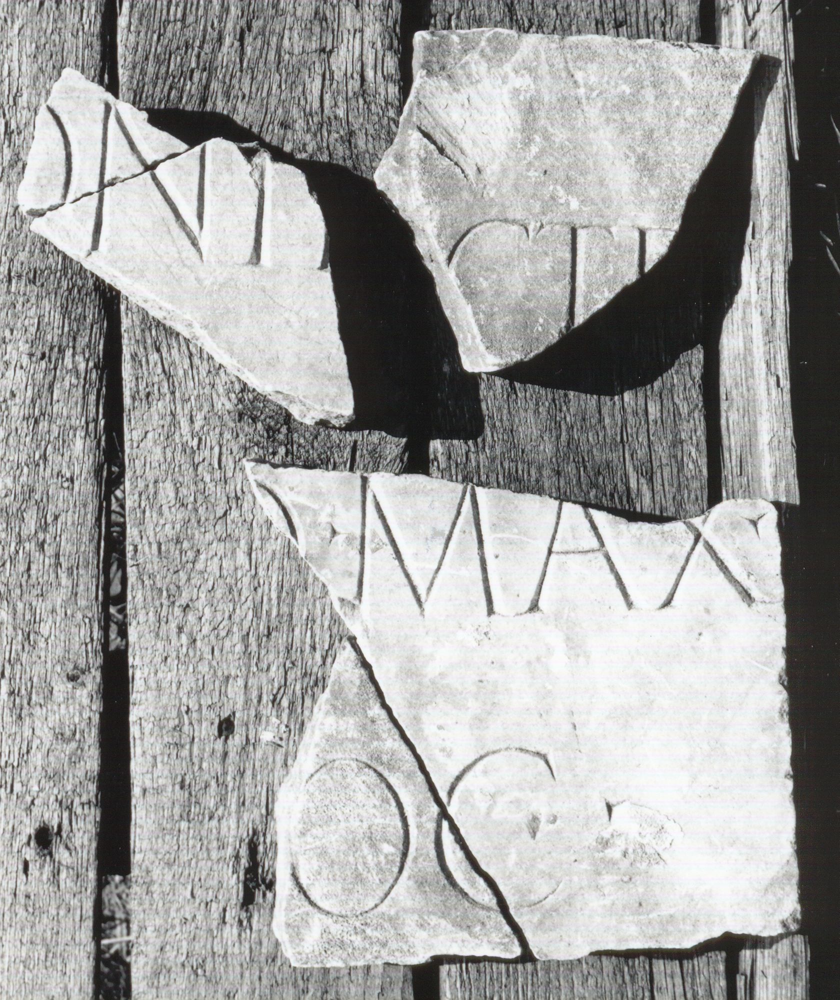

# EDH HD043697. Colonia Ulpia Traiana Sarmizegetusa

**Країна.** Румунія

**Провінція (код EDH).** Dac

**Місце знахідки (антична назва).** Colonia Ulpia Traiana Sarmizegetusa

**Сучасна назва.** Sarmizegetusa

**Деталі знахідки.** Praetorium procuratoris, {area sacra}

**Координати.** 45.515134153,22.787739334

**Датування (роки, від'ємні до н. е.).** 161 … 217

**Тип пам'ятки.** Tafel

**Розміри (висота, ширина, глибина, см).** -11.0 × -13.0 × 3.5

## Текст (латинь, скорочення розкрито)

```
$ Ant]onin[---] / [& // $]o max(imo) / [--- pr]oc(urator) / [&
```

## Текст у вихідному записі

```
]ONIN[ ] / [ / / ]O MAX / [ ]OC / [
```

## Коментар

2 nicht aneinanderpassende Fragmente (jeweils aus 2 Teilen zusammengesetzt); Maße beziehen sich auf Fragment a; Maße b: (21) x (22,5) x 3 cm. (B): ILD: Z. 2: maxi(mo).

## Література

AE 1998, 1090.
- ILD 267. (B)
- I. Piso, ZPE 120, 1998, 258-259, Nr. 3; Abb. 6 u. 7 (Fotos u. Zeichnungen). - AE 1998. #

## Фото



Джерело https://edh.ub.uni-heidelberg.de/edh/inschrift/HD043697, ліцензія CC BY-SA 4.0. Оригінальний XML в архіві сирі_дані/edh_xml.zip
