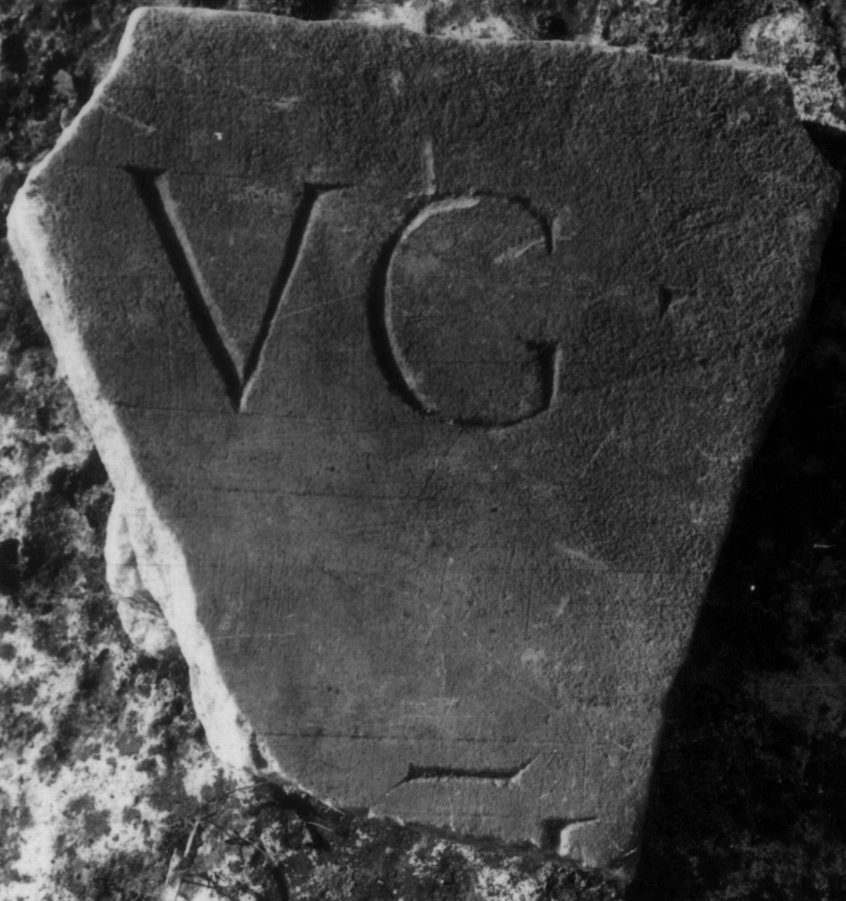
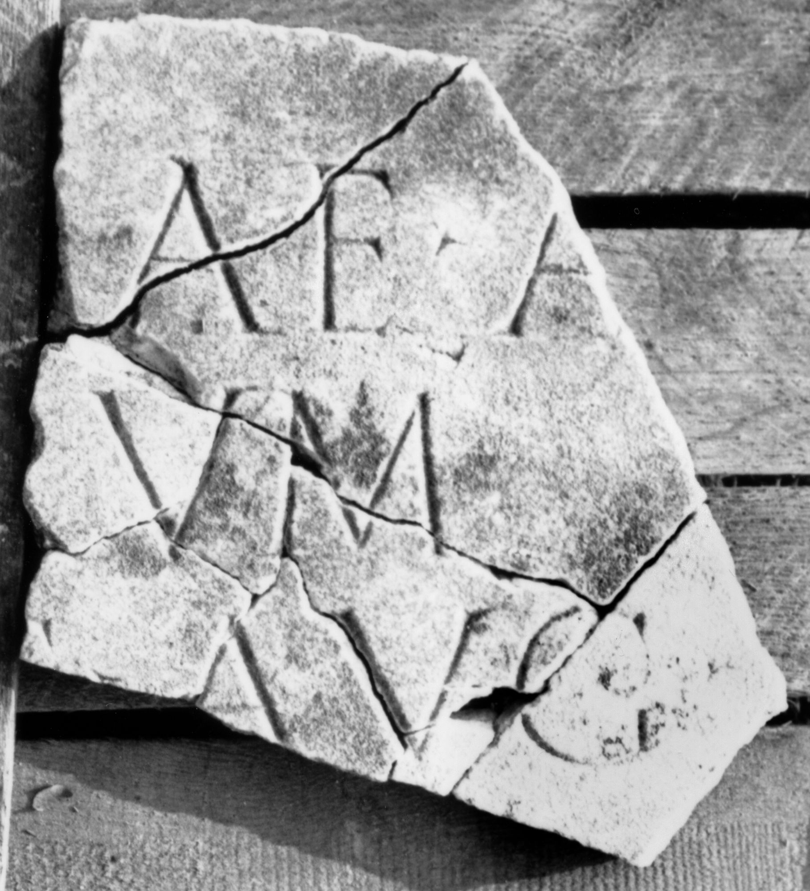

# EDH HD043698. Colonia Ulpia Traiana Sarmizegetusa

**Країна.** Румунія

**Провінція (код EDH).** Dac

**Місце знахідки (антична назва).** Colonia Ulpia Traiana Sarmizegetusa

**Сучасна назва.** Sarmizegetusa

**Деталі знахідки.** Praetorium procuratoris, area sacra, {Serapeum}

**Координати.** 45.515011988,22.787640094

**Зберігання.** Sarmizegetusa, Muz. Arh.

**Датування (роки, від'ємні до н. е.).** 224 … 235

**Тип пам'ятки.** Tafel

**Розміри (висота, ширина, глибина, см).** -20.0 × -30.5 × 2.5

## Текст (латинь, скорочення розкрито)

```
[Pro salute Imp(eratoris) Caes(aris) M(arci) Aureli] / [Severi [[Alexandri]] Pii Fel(icis) Aug(usti) et] / [[[Iul]iae M[amaeae]] san]c[tissi]mae Aug(ustae) / [[[m]atr[is]] Aug(usti) n(ostri)] et cas[tro]rum / M(arcus) Luccei[us] Fe[li]x [pro]c(urator) Aug(usti) n(ostri) / [---]imu[& // $]mus [---]
```

## Текст у вихідному записі

```
[ ] / [[[ ]]] / [[[ ] M[ ]]]C[ ]MAE AVG / [[[ ]ATR[ ]]] ET CAS[ ]RVM / M LVCCEI[ ] FE[ ]X [ ]C AVG N / [ ]IMV[ / / ]MVS [ ]
```

## Коментар

Zahlreiche, teils aneinanderpassende Fragmente; Maße beziehen sich auf das linke Fragment, das einen Teil des linken Randes einschließt. Ergänzungsvorschlag nach Piso. (B): IDR III; Piso; AE 1998: Leseabweichungen.

## Література

AE 1998, 1091. (B)
- ILD 268. (B)
- IDR 3, 2, 145; fig. 118 (Foto u. Zeichnung).
- I. Piso, ZPE 120, 1998, 259-260, Nr. 4; Foto u. Zeichnung. (B) - AE 1998. #

## Фото





Джерело https://edh.ub.uni-heidelberg.de/edh/inschrift/HD043698, ліцензія CC BY-SA 4.0. Оригінальний XML в архіві сирі_дані/edh_xml.zip
