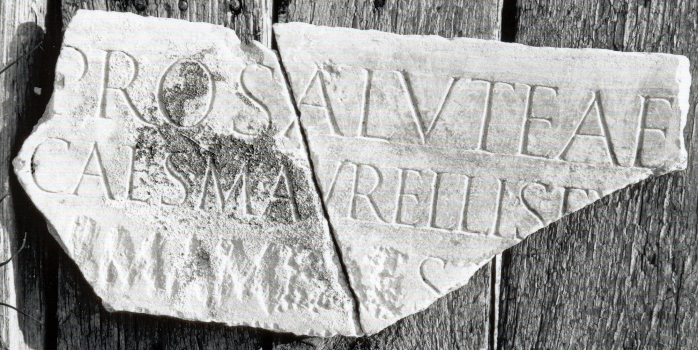

# EDH HD043699. Colonia Ulpia Traiana Sarmizegetusa

**Країна.** Румунія

**Провінція (код EDH).** Dac

**Місце знахідки (антична назва).** Colonia Ulpia Traiana Sarmizegetusa

**Сучасна назва.** Sarmizegetusa

**Деталі знахідки.** Praetorium procuratoris, {area sacra}

**Координати.** 45.515134153,22.787739334

**Датування (роки, від'ємні до н. е.).** 224 … 235

**Тип пам'ятки.** Tafel

**Розміри (висота, ширина, глибина, см).** -31.0 × -47.5 × 3.0

## Текст (латинь, скорочення розкрито)

```
Pro salute ae[terna] / Imp(eratoris) Caes(aris) M(arci) Aurelli(!) Sev[eri Alexandri Aug(usti) et] / [[Iuliae Mam(a)eae]] s[anctissimae Augustae] / [[ma[tris]] Aug(usti) n(ostri) et castrorum] / templi SI(?)[---] / I(?)C(?)[&
```

## Текст у вихідному записі

```
PRO SALVTE AE[ ] / IMP CAES M AVRELLI SEV[ ] / [[IVLIAE MAMEAE]] S[ ] / [[MA[ ]]] / TEMPLI SI[ ] / IC[
```

## Коментар

4 aneinanderpassende Fragmente erhalten; nach Piso gehörte das Fragment AE 1998, 1095 vielleicht zur selben Inschrift. Z. 6: statt C auch O, Q oder S möglich. (B): Piso; AE 1998; ILD: Abweichungen in der Lesung.

## Література

AE 1998, 1093. (B)
- ILD 270. (B)
- I. Piso, ZPE 120, 1998, 261-262, Nr. 6; Foto u. Zeichnung. (B) - AE 1998. #

## Фото



Джерело https://edh.ub.uni-heidelberg.de/edh/inschrift/HD043699, ліцензія CC BY-SA 4.0. Оригінальний XML в архіві сирі_дані/edh_xml.zip
