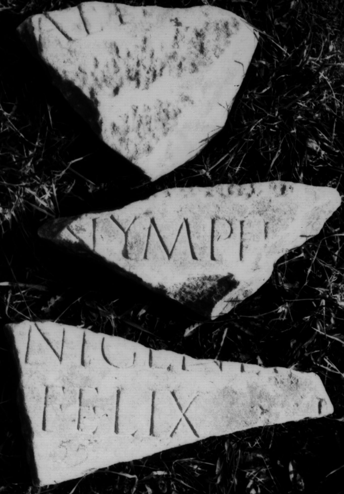

# EDH HD043704. Colonia Ulpia Traiana Sarmizegetusa

**Країна.** Румунія

**Провінція (код EDH).** Dac

**Місце знахідки (антична назва).** Colonia Ulpia Traiana Sarmizegetusa

**Сучасна назва.** Sarmizegetusa

**Координати.** 45.516666699,22.783333299

**Зберігання.** Deva, Muz. Civil. Dac. şi Rom.

**Датування (роки, від'ємні до н. е.).** 224 … 235

**Тип пам'ятки.** Tafel

**Розміри (висота, ширина, глибина, см).** -13.0 × -15.0 × 3.0

## Текст (латинь, скорочення розкрито)

```
[Pro salute] aete[rna] / [Imp(eratoris) Caes(aris) M(arci) Aureli] Sever[i [[Alexandri]] Pii Felicis Aug(usti) et] / [[[Iuliae Mamaeae matris]] Aug(usti) n(ostri) et ca]str(orum) [--- et universi huma]ni gener[is] / nymph[aeum --- M(arcus) Lucceius] Felix p[roc(urator) Aug(usti) n(ostri)] / [&
```

## Текст у вихідному записі

```
[ ] AETE[ ] / [ ] SEVER[[[ ]]] / [[[ ]]]STR [ ]NI GENER[ ] / NYMPH[ ] FELIX P[ ] / [
```

## Коментар

4 Fragmente, von denen eines (d) verschollen ist; Maße beziehen sich auf Fragment a; Maße b: (7) x (20) x 5 cm; c: (11) x (12) x 3 cm; Ergänzungsvorschlag nach Piso; Zeilenfälle unsicher. (B): IDR III; Piso; AE 1998; ILD: abweichende Textwiedergabe.

## Література

AE 1998, 1094. (B)
- ILD 271. (B)
- CIL 03, 07970.
- IDR 3, 2, 064; fig. 52 (Fotos u. Zeichnungen). (B)
- I. Piso, ZPE 120, 1998, 262-263, Nr. 7; Fotos u. Zeichnungen. (B) - AE 1998. #

## Фото



Джерело https://edh.ub.uni-heidelberg.de/edh/inschrift/HD043704, ліцензія CC BY-SA 4.0. Оригінальний XML в архіві сирі_дані/edh_xml.zip
