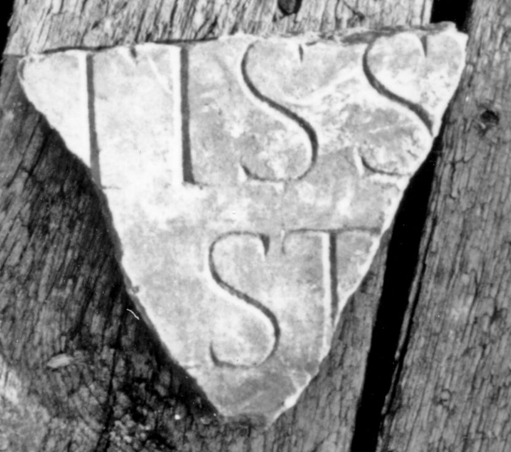

# EDH HD043705. Colonia Ulpia Traiana Sarmizegetusa

**Країна.** Румунія

**Провінція (код EDH).** Dac

**Місце знахідки (антична назва).** Colonia Ulpia Traiana Sarmizegetusa

**Сучасна назва.** Sarmizegetusa

**Деталі знахідки.** Praetorium procuratoris, {area sacra}

**Координати.** 45.515134153,22.787739334

**Датування (роки, від'ємні до н. е.).** 211 … 248

**Тип пам'ятки.** Tafel

**Розміри (висота, ширина, глибина, см).** -11.0 × -13.0 × 3.0

## Текст (латинь, скорочення розкрито)

```
$ sanc]tiss[imae Aug(ustae) ---] / [--- matri --- et c]ast[rorum &
```

## Текст у вихідному записі

```
]TISS[ ] / [ ]AST[
```

## Коментар

Ergänzungsvorschlag nach Piso; möglicherweise zu AE 1998, 1093 gehörig. Datierung: nach Piso war Iulia Domna, Iulia Mamaea oder Otacilia Severa genannt.

## Література

AE 1998, 1095.
- ILD 272.
- I. Piso, ZPE 120, 1998, 263, Nr. 8; Foto u. Zeichnung. - AE 1998. #

## Фото



Джерело https://edh.ub.uni-heidelberg.de/edh/inschrift/HD043705, ліцензія CC BY-SA 4.0. Оригінальний XML в архіві сирі_дані/edh_xml.zip
