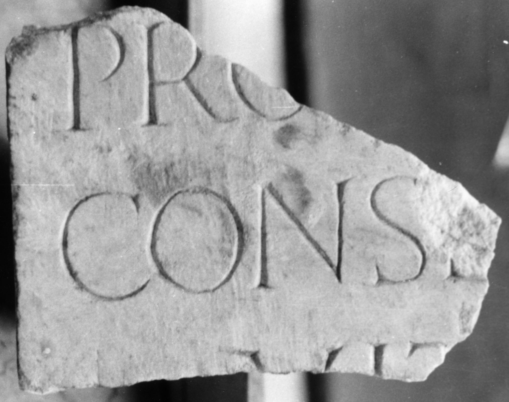

# EDH HD043726. Colonia Ulpia Traiana Sarmizegetusa

**Країна.** Румунія

**Провінція (код EDH).** Dac

**Місце знахідки (антична назва).** Colonia Ulpia Traiana Sarmizegetusa

**Сучасна назва.** Sarmizegetusa

**Деталі знахідки.** Praetorium procuratoris, {area sacra}

**Координати.** 45.515134153,22.787739334

**Датування (роки, від'ємні до н. е.).** 222 … 235

**Тип пам'ятки.** Tafel

**Розміри (висота, ширина, глибина, см).** -15.0 × -9.5 × 11.5

## Текст (латинь, скорочення розкрито)

```
[M(arcus) Lucceius] / [Felix] / pro[c(urator) Aug(usti) n(ostri)] / conse[cra]/vit
```

## Текст у вихідному записі

```
[ ] / [ ] / PRO[ ] / CONSE[ ] / VIT
```

## Література

AE 1998, 1098.
- ILD 275.
- I. Piso, ZPE 120, 1998, 264, Nr. 11; Foto u. Zeichnung. - AE 1998. #

## Фото



Джерело https://edh.ub.uni-heidelberg.de/edh/inschrift/HD043726, ліцензія CC BY-SA 4.0. Оригінальний XML в архіві сирі_дані/edh_xml.zip
