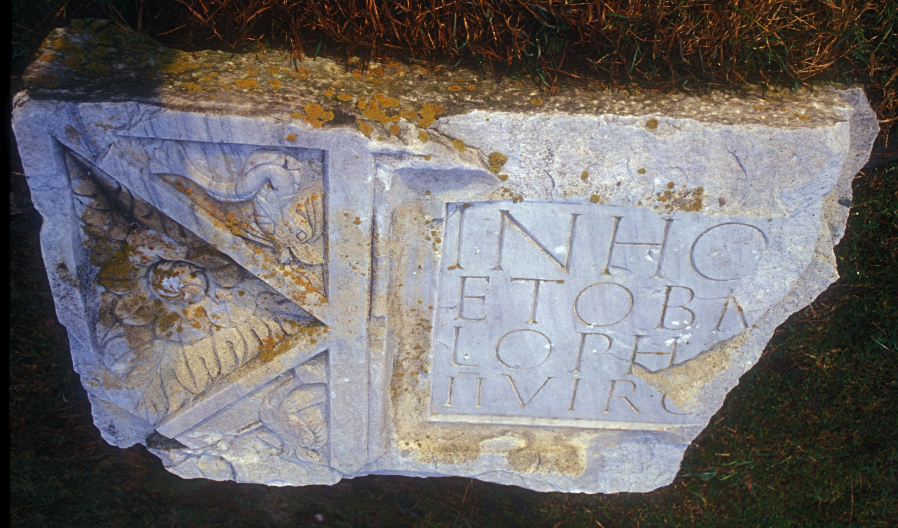

# EDH HD043730. Colonia Ulpia Traiana Sarmizegetusa

**Країна.** Румунія

**Провінція (код EDH).** Dac

**Місце знахідки (антична назва).** Colonia Ulpia Traiana Sarmizegetusa

**Сучасна назва.** Sarmizegetusa

**Деталі знахідки.** Forum Vetus, {westliches Nymphäum}

**Координати.** 45.513624912,22.787514030

**Зберігання.** Sarmizegetusa, Muz. Arh.

**Датування (роки, від'ємні до н. е.).** 193 … 211

**Тип пам'ятки.** Architekturteil

**Розміри (висота, ширина, глибина, см).** 78.0 × 350.0 × 30.0

## Текст (латинь, скорочення розкрито)

```
In hono[r]e[m do]m[us divinae] / et ob m[erita eius ---] / L(ucius) Opho[ni]us [Pap(iria) D]o[mi]t[ius Priscus] / IIvir c[ol(oniae)] Dac[icae pec(unia) sua fecit l(ocus) d(atus) d(ecreto) d(ecurionum)]
```

## Текст у вихідному записі

```
IN HONO[ ]E[ ]M[ ] / ET OB M[ ] / L OPHO[ ]VS [ ]O[ ]T[ ] / IIVIR C[ ] DAC[ ]
```

## Коментар

Textwiedergabe nach Zeichung (pl. 40, 26). Vom Nymphäum; 14 Fragmente der Inschriftentafel erhalten; die angegebenen Maße sind die rekonstruierten Abmessungen.

## Література

AE 2003, 1521.
- R. Étienne - I. Piso - A. Daiconescu, ActaMusNapoca 39/40, 2002/03, 126, Anm. 111; pl. 40, 26 (Zeichnung). - AE 2003.
- I. Piso, in: I. Piso (Hrsg.), Le forum vetus de Sarmizegetusa 1 (Bucureşti 2006) 246-247, Nr. 26; Fig. 3, 24 (Foto u. Zeichnung). #

## Фото



Джерело https://edh.ub.uni-heidelberg.de/edh/inschrift/HD043730, ліцензія CC BY-SA 4.0. Оригінальний XML в архіві сирі_дані/edh_xml.zip
