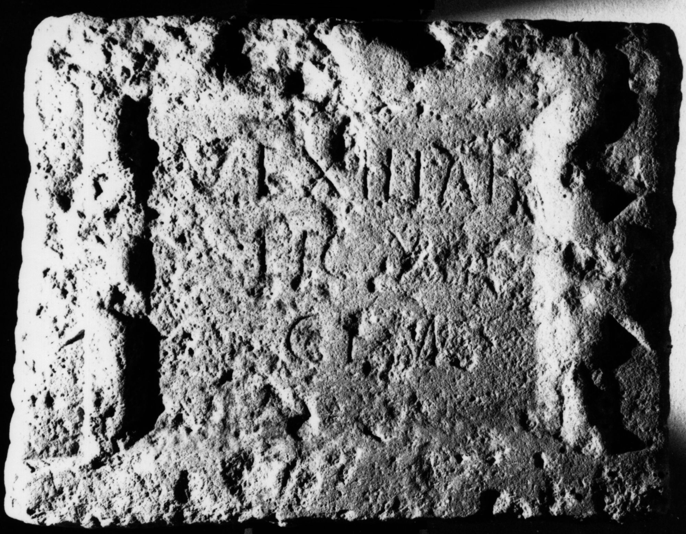

# EDH HD043753. Surduc

**Країна.** Румунія

**Провінція (код EDH).** Dac

**Сучасна назва.** Surduc

**Деталі знахідки.** Tihău, {"Grădişte"}, Lager

**Координати.** 47.244133931,23.337578773

**Зберігання.** Zalău, Muz. Ist. Artă

**Датування (роки, від'ємні до н. е.).** 118 … 119

**Тип пам'ятки.** Tafel

**Розміри (висота, ширина, глибина, см).** 54.0 × 70.0 × 14.0

## Текст (латинь, скорочення розкрито)

```
Vexillat(io) / leg(ionis) XIII / gem(inae)
```

## Текст у вихідному записі

```
VEXILLAT / LEG XIII / GEM
```

## Коментар

Im Lager gefunden. Inschriftfeld in Form einer tabula ansata.

## Література

AE 1994, 1484.
- ILD 760.
- N. Gudea - V. Lucăcel, Inscripţii şi monumente sculpturale în Muzeul de Istorie şi Artă Zalău (Zalău 1975) 27-28, Nr. 54; Foto.
- D. Protase, EphNapocensis 4, 1994, 94; fig. 10 (Foto u. Zeichnung). - AE 1994.
- V. Wollmann - G. Bot, in: H. Daicoviciu (Hrsg.), In memoriam Constantini Daicoviciu (Cluj 1974) 431, Nr. 1; fig. 2a; fig. 2b (Zeichnung). - AE 1994. #

## Фото



Джерело https://edh.ub.uni-heidelberg.de/edh/inschrift/HD043753, ліцензія CC BY-SA 4.0. Оригінальний XML в архіві сирі_дані/edh_xml.zip
