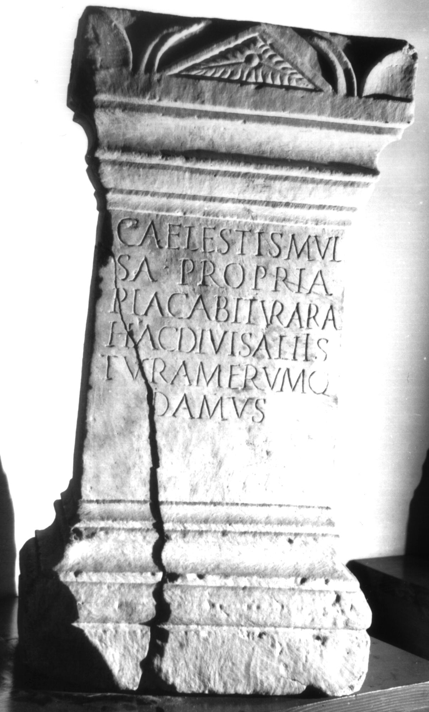

# EDH HD043765. Colonia Ulpia Traiana Sarmizegetusa

**Країна.** Румунія

**Провінція (код EDH).** Dac

**Місце знахідки (антична назва).** Colonia Ulpia Traiana Sarmizegetusa

**Сучасна назва.** Sarmizegetusa

**Деталі знахідки.** Praetorium procuratoris, {area sacra}

**Координати.** 45.515134153,22.787739334

**Зберігання.** Sarmizegetusa, Muz. Arh.

**Датування (роки, від'ємні до н. е.).** 201 … 250

**Тип пам'ятки.** Altar

**Розміри (висота, ширина, глибина, см).** 74.0 × 36.5 × 20.0

## Текст (латинь, скорочення розкрито)

```
Caelestis mul/sa propria / placabitur ara / hac divis aliis / tura merumq(ue) / damus
```

## Текст у вихідному записі

```
CAELESTIS MVL / SA PROPRIA / PLACABITVR ARA / HAC DIVIS ALIIS / TVRA MERVMQ / DAMVS
```

## Коментар

Metrum: elegisches Distichon. (B): AE 1993; ILD: Leseabweichungen.

## Література

AE 1993, 1345. (B)
- ILD 282. (B)
- I. Piso, ZPE 99, 1993, 223-226; Taf. 14c. - AE 1993. #

## Фото



Джерело https://edh.ub.uni-heidelberg.de/edh/inschrift/HD043765, ліцензія CC BY-SA 4.0. Оригінальний XML в архіві сирі_дані/edh_xml.zip
