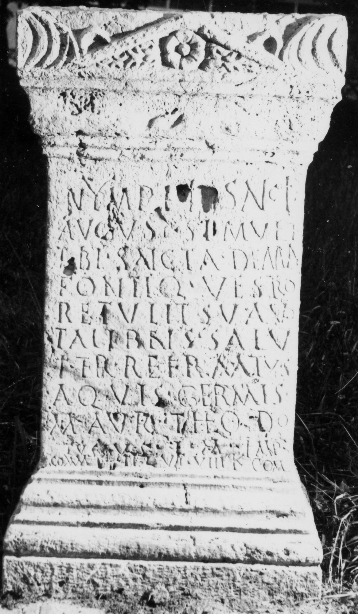

# EDH HD043783. Germisara

**Країна.** Румунія

**Провінція (код EDH).** Dac

**Місце знахідки (антична назва).** Germisara

**Сучасна назва.** Geoagiu

**Деталі знахідки.** Geoagiu Băi, {Thermalbad, heiliger Bezirk}

**Координати.** 45.935603871,23.162197171

**Рік знахідки.** 1987

**Зберігання.** Deva, Muz. Civil. Dac. şi Rom.

**Датування (роки, від'ємні до н. е.).** 190 … 

**Тип пам'ятки.** Altar

**Розміри (висота, ширина, глибина, см).** 94.0 × 51.0 × 39.0

## Текст (латинь, скорочення розкрито)

```
Nymphi[s] sanctis / August(is) simul et / tibi sancta Deana / fontiq(ue) vestro / ret(t)ulit sua vo/ta libens salu/ti ter refirmatus / aquis Germis(arae?) / M(arcus) Aur(elius) Theodo/tus v(otum) s(olvit) l(ibens) m(erito) Imp(eratore) / Comm(odo) [Fe]lice c(onsule) VI VIII Kal(endas) Com(modas)
```

## Текст у вихідному записі

```
NYMPHI[ ] SANCTIS / AVGVST SIMVL ET / TIBI SANCTA DEANA / FONTIQ VESTRO / RETVLIT SVA VO / TA LIBENS SALV / TI TER REFIRMATVS / AQVIS GERMIS / M AVR THEODO / TVS V S L M IMP / COMM [ ]LICE C VI VIII KAL COM
```

## Коментар

(B): AE 1992, ILD: Z. 10/11: abweichende Textverteilung.

## Література

AE 1992, 1484. (B)
- ILD 326. (B)
- I. Piso - A. Rusu, RevMon 59, 1990, 14-15, Nr. 8; fig. 14; fig. 15 (Zeichnung). - AE 1992. #

## Фото



Джерело https://edh.ub.uni-heidelberg.de/edh/inschrift/HD043783, ліцензія CC BY-SA 4.0. Оригінальний XML в архіві сирі_дані/edh_xml.zip
