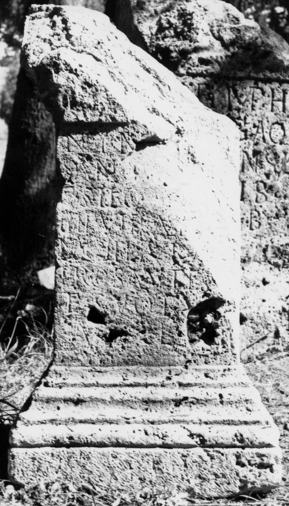
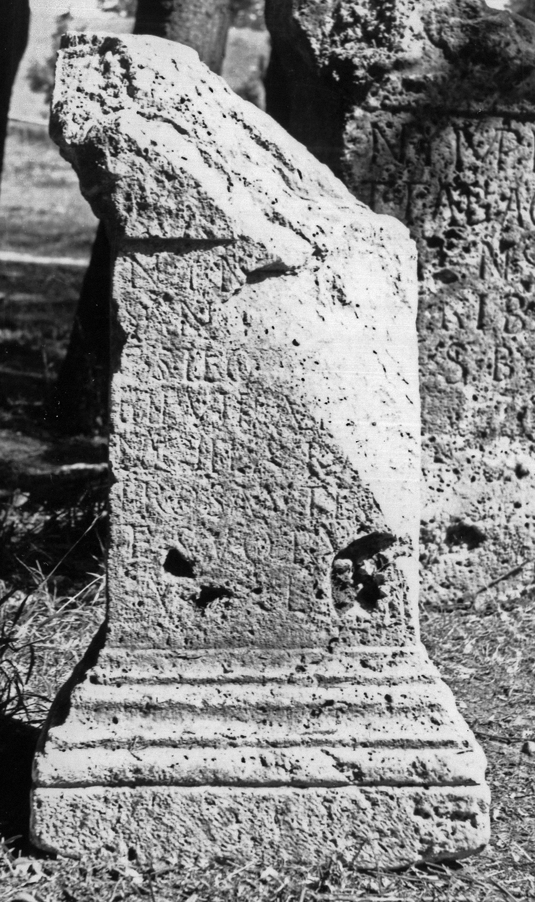

# EDH HD043784. Germisara

**Країна.** Румунія

**Провінція (код EDH).** Dac

**Місце знахідки (антична назва).** Germisara

**Сучасна назва.** Geoagiu

**Деталі знахідки.** Geoagiu Băi, {Thermalbad, heiliger Bezirk}

**Координати.** 45.935603871,23.162197171

**Рік знахідки.** 1987

**Датування (роки, від'ємні до н. е.).** 180 … 185

**Тип пам'ятки.** Statuenbasis?

**Розміри (висота, ширина, глибина, см).** 86.0 × 47.0 × 38.0

## Текст (латинь, скорочення розкрито)

```
Nym[phis] / sanc[tissimis] / C(aius) Siro[n(ius) ---] / IIIIvirali[s mu]/nicipi(i) Aur(eli) A[pul(ensis)] / pro salute s[ua] / et suoru[m] / v(otum) s(olvit) l(ibens) [m(erito)]
```

## Текст у вихідному записі

```
NYM[ ] / SANC[ ] / C SIRO[ ] / IIIIVIRALI[ ] / NICIPI AVR A[ ] / PRO SALVTE S[ ] / ET SVORV[ ] / V S L [ ]
```

## Коментар

Statuenbasis oder Altar.

## Література

AE 1992, 1485.
- ILD 327. #

## Фото





Джерело https://edh.ub.uni-heidelberg.de/edh/inschrift/HD043784, ліцензія CC BY-SA 4.0. Оригінальний XML в архіві сирі_дані/edh_xml.zip
