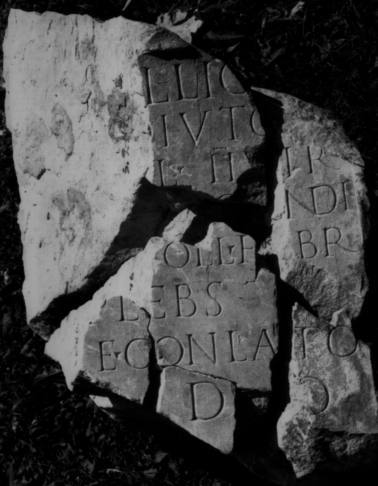
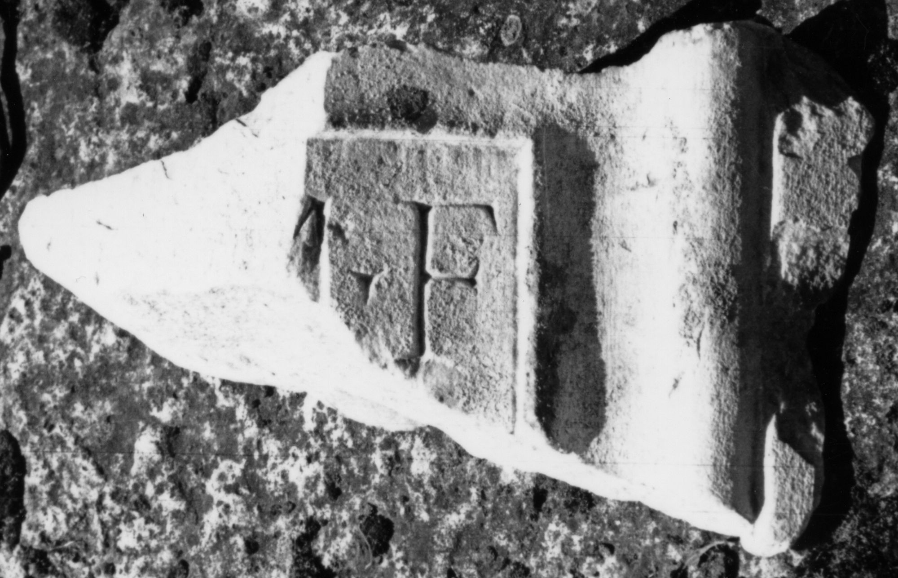
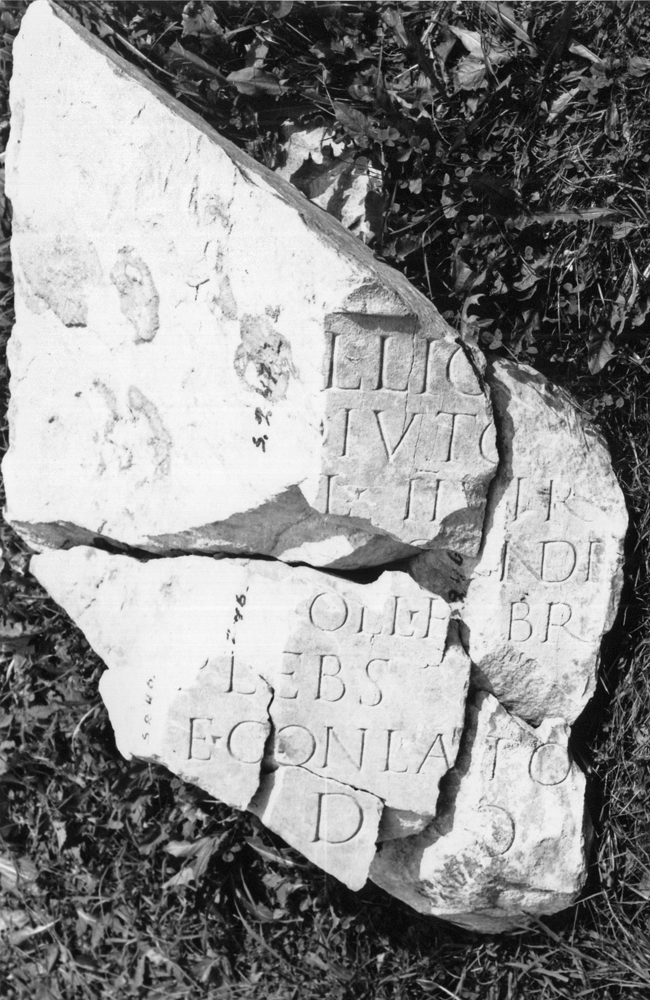
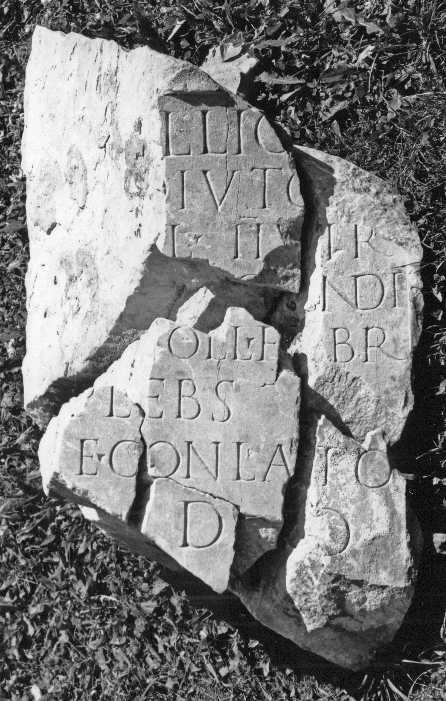

# EDH HD043821. Colonia Ulpia Traiana Sarmizegetusa

**Країна.** Румунія

**Провінція (код EDH).** Dac

**Місце знахідки (антична назва).** Colonia Ulpia Traiana Sarmizegetusa

**Сучасна назва.** Sarmizegetusa

**Деталі знахідки.** {Forum Novum, nördliche Kryptoportikus}

**Координати.** 45.512815618,22.787882326

**Рік знахідки.** -1930

**Зберігання.** Sarmizegetusa, Muz. Arh.

**Датування (роки, від'ємні до н. е.).** 151 … 170

**Тип пам'ятки.** Statuenbasis

**Розміри (висота, ширина, глибина, см).** -80.0 × -60.0 × -56.0

## Текст (латинь, скорочення розкрито)

```
M(arco) O[pe]llio M(arci) f(ilio) / Pap(iria) [A]diuto[ri] / d[ec(urioni) co]l(oniae) IIvir(o) / [iuris di]c[u]ndi / p[raef(ecto) c]oll(egii) f[a]br(um) / plebs / a[e]re conlato / l(ocus) d(atus) d(ecreto) d(ecurionum)
```

## Текст у вихідному записі

```
M O[ ]LLIO M F / PAP [ ]DIVTO[ ] / D[ ]L IIVIR / [ ]C[ ]NDI / P[ ]OLL F[ ]BR / PLEBS / A[ ]RE CONLATO / L D D D
```

## Коментар

(B): IDR: abweichende Ergänzungen.

## Література

AE 2003, 1514.
- IDR 3, 2, 116; fig. 91 (Foto u. Zeichnung). (B)
- I. Piso, ActaMusNapoca 39/40, 2002/03, 215-218, Nr. 15; fig. 4a; fig. 4b (Zeichnung). - AE 2003.
- ILD 243. #

## Фото









Джерело https://edh.ub.uni-heidelberg.de/edh/inschrift/HD043821, ліцензія CC BY-SA 4.0. Оригінальний XML в архіві сирі_дані/edh_xml.zip
