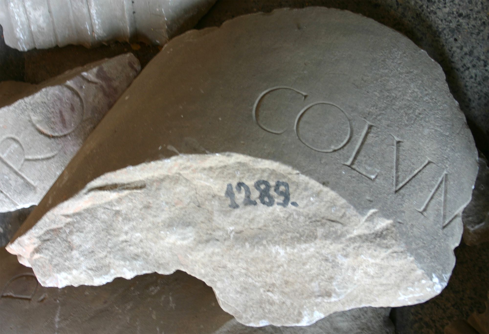

# EDH HD043823. Colonia Ulpia Traiana Sarmizegetusa

**Країна.** Румунія

**Провінція (код EDH).** Dac

**Місце знахідки (антична назва).** Colonia Ulpia Traiana Sarmizegetusa

**Сучасна назва.** Sarmizegetusa

**Деталі знахідки.** {Decumanus maximus}

**Координати.** 45.513636189,22.787559628

**Рік знахідки.** 1993

**Зберігання.** Sarmizegetusa, Muz. Arh.

**Датування (роки, від'ємні до н. е.).** 138 … 180

**Тип пам'ятки.** Architekturteil

**Розміри (висота, ширина, глибина, см).** -110.0 × 64.0 × 25.0

## Текст (латинь, скорочення розкрито)

```
Colum[nas?] / pecuni[a sua] / ded[it]
```

## Текст у вихідному записі

```
COLVM[ ] / PECVNI[ ] / DED[ ]
```

## Коментар

2 Fragmente eines Säulenschafts; wahrscheinlich eine der 4 Säulen des Propylons. Möglicherweise war der Stifter L. Valerius Valens (AE 2003, 1524a). Datierung: wahrscheinlich unter Antoninus Pius oder Mark Aurel.

## Література

AE 2003, 1524b.
- R. Étienne - I. Piso - A. Diaconescu, ActaMusNapoca 39/40, 2002/03, 110, Anm. 85; pl. 33, 55. - AE 2003.
- I. Piso, in: I. Piso (Hrsg.), Le forum vetus de Sarmizegetusa 1 (Bucureşti 2006) 279-280, Nr. 54; fig. 3, 52 (Foto u. Zeichnung). #

## Фото



Джерело https://edh.ub.uni-heidelberg.de/edh/inschrift/HD043823, ліцензія CC BY-SA 4.0. Оригінальний XML в архіві сирі_дані/edh_xml.zip
