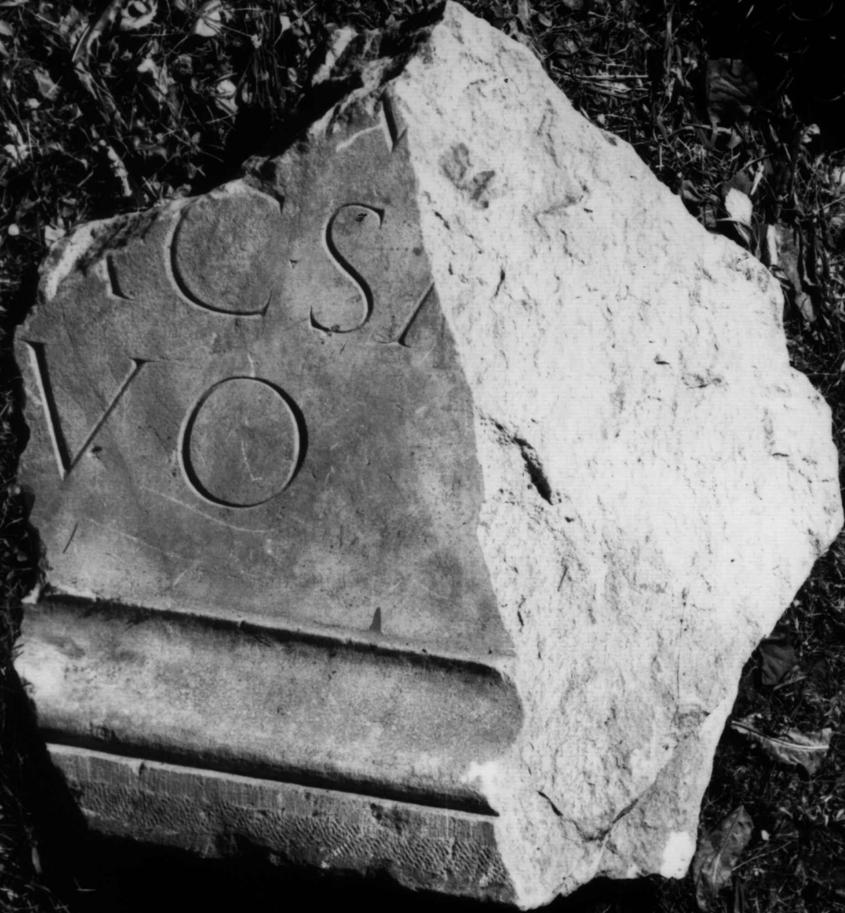

# EDH HD043824. Colonia Ulpia Traiana Sarmizegetusa

**Країна.** Румунія

**Провінція (код EDH).** Dac

**Місце знахідки (антична назва).** Colonia Ulpia Traiana Sarmizegetusa

**Сучасна назва.** Sarmizegetusa

**Деталі знахідки.** Forum Vetus, {Hof}

**Координати.** 45.513370085,22.787732122

**Рік знахідки.** 1991

**Зберігання.** Sarmizegetusa, Muz. Arh.

**Датування (роки, від'ємні до н. е.).** 98 … 117

**Матеріал.** Marmor

**Тип пам'ятки.** Tafel

**Розміри (висота, ширина, глибина, см).** 90.0 × 120.0 × 35.0

## Текст (латинь, скорочення розкрито)

```
[Imp(eratori) Caes(ari) divi Nervae fil(io) Ne]r[vae] Tr[aiano] / [Opti?]mo [Au]g(usto) [Germ(anico) Dac(ico) Parth(ico)? pontif(ici)] m[ax(imo) trib(unicia)] / [potest(ate) ---] P(?)O[---]V[---] / [col(onia) Ulpia Traiana Aug(usta) D]ac(ica) Sa[rmizegetusa] / [condit]o[ri s]uo
```

## Текст у вихідному записі

```
[ ]R[ ] TR[ ] / [ ]MO [ ]G [ ] M[ ] / [ ] PO[ ]V[ ] / [ ]AC SA[ ] / [ ]O[ ]VO
```

## Коментар

Neun Fragmente erhalten. Angabe der rekonstruierten Abmessungen der Tafel. IDR: nur eines der neun Fragmente.

## Література

AE 2003, 1515.
- R. Étienne - I. Piso - A. Diaconescu, ActaMusNapoca 39/40, 2002/03, 131, Anm. 122.
- IDR 3, 2, 135; fig. 109 (Foto u. Zeichnung).
- ILD 239.
- I. Piso, in: I. Piso (Hrsg.), Le forum vetus de Sarmizegetusa 1 (Bucureşti 2006) 217-219, Nr. 4; Fig. 3, 4 (Fotos u. Zeichnung). #

## Фото



Джерело https://edh.ub.uni-heidelberg.de/edh/inschrift/HD043824, ліцензія CC BY-SA 4.0. Оригінальний XML в архіві сирі_дані/edh_xml.zip
