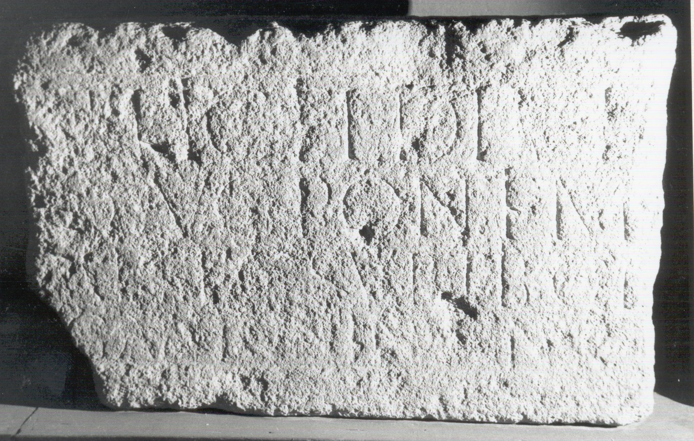

# EDH HD043865. Hoghiz

**Країна.** Румунія

**Провінція (код EDH).** Dac

**Сучасна назва.** Hoghiz

**Деталі знахідки.** {Lager}

**Координати.** 45.978149851,25.278920746

**Зберігання.** Sibiu, Muz. Brukenthal

**Датування (роки, від'ємні до н. е.).** 130 … 

**Тип пам'ятки.** Tafel

**Розміри (висота, ширина, глибина, см).** 78.0 × -123.0 × 25.0

## Текст (латинь, скорочення розкрито)

```
[Imp(eratore) Caes(are) divi Traiani Pa]rthic(i) fil(io) divi / [Nervae nep(ote) Traiano Hadria]no Aug(usto) pontif(ice) m(aximo) / [trib(unicia) potest(ate) --- co(n)s(ule) III p(atre) p(atriae) vex(illatio) leg(ionis)] XIII g(eminae) sub Tib(erio) Cl(audio) / [Constante? proc(uratore)? Aug(usti)? pro? leg(ato)? c(uram)? a?]g(ente) Antonin[i]ano [c(enturione)?]
```

## Текст у вихідному записі

```
[ ]RTHIC FIL DIVI / [ ]NO AVG PONTIF M / [ ] XIII G SVB TIB CL / [ ]G ANTONIN[ ]ANO [ ]
```

## Коментар

Datierung: um 130 n. Chr. (Prokuratur des Tib. Cl. Constans). (B): CIL III; Russu; IDR III 4: Abweichungen in Lesung / Ergänzung.

## Література

AE 2000, 1258.
- I. Piso, ActaMusNapoca 37, 1, 2000, 235. - AE 2000.
- CIL 03, 00953. (B)
- IDR 3, 4, 230; fig. 140 (Foto u. Zeichnung). (B)
- ILD 431.
- I.I. Russu, AnInstCluj 18, 1975, 50-54; fig. 1 (Foto u. Zeichnung). (B) #

## Фото



Джерело https://edh.ub.uni-heidelberg.de/edh/inschrift/HD043865, ліцензія CC BY-SA 4.0. Оригінальний XML в архіві сирі_дані/edh_xml.zip
