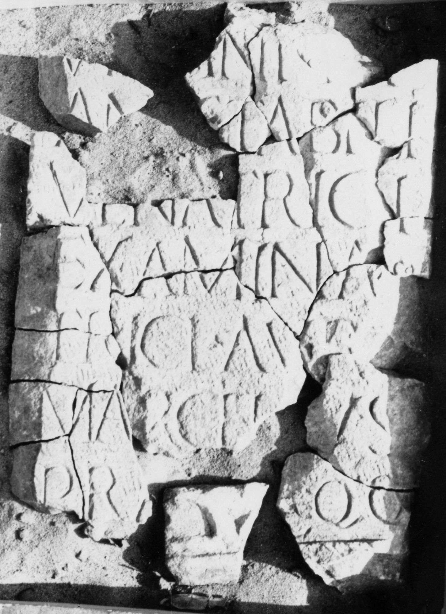

# EDH HD043908. Gilău

**Країна.** Румунія

**Провінція (код EDH).** Dac

**Сучасна назва.** Gilău

**Деталі знахідки.** {Lager}, Prätorium

**Координати.** 46.756696069,23.382583000

**Датування (роки, від'ємні до н. е.).** 201 … 250

**Тип пам'ятки.** Altar

## Текст (латинь, скорочення розкрито)

```
[Dea]e / vi[r]gini Di/an[ae] stabili / venatrici / examina/trici Aur(elius) / Marcellus / pra[ef(ectus)] eqq(uitum)
```

## Текст у вихідному записі

```
[ ]E / VI[ ]GINI DI / AN[ ] STABILI / VENATRICI / EXAMINA / TRICI AVR / MARCELLVS / PRA[ ] EQQ
```

## Коментар

Stark fragmentiert. 23 Fragmente erhalten.

## Література

AE 1991, 1350.
- ILD 598.
- D. Isac, Chiron 21, 1991, 345-348, Nr. 1; Taf. 1 (Foto u. Zeichnung). - AE 1991. #

## Фото



Джерело https://edh.ub.uni-heidelberg.de/edh/inschrift/HD043908, ліцензія CC BY-SA 4.0. Оригінальний XML в архіві сирі_дані/edh_xml.zip
